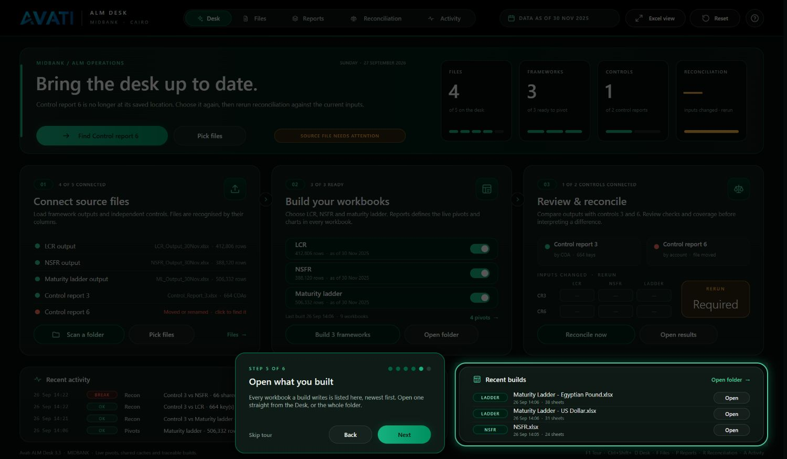
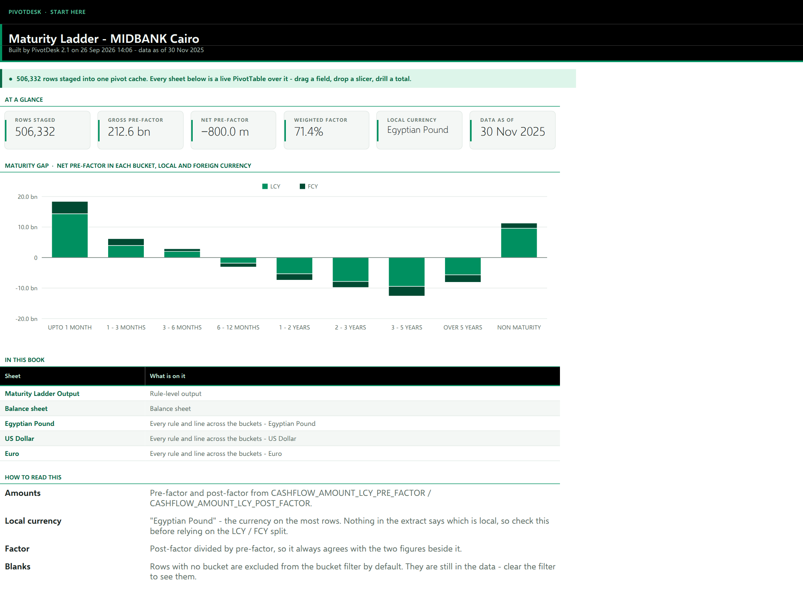

# PivotDesk 2.1

A desk for daily ALM analysis at MIDBANK Cairo. Point it at the LCR, NSFR and
maturity-ladder outputs and control reports 3 and 6; it recognises each file by
its columns, builds one workbook of live PivotTables per framework, and
reconciles the outputs against the control reports.

**It is one application, not two.** Since 2.0 the separate console window
is gone. Everything it did, and the state the sheets used to hold, is on the
**Desk**. While the workbook is in front it runs as an application: the ribbon,
formula bar and sheet tabs step aside, and the Desk fills the window. When
another workbook comes to the front, Excel's chrome is put back as it was.


## Using it

1. Open `dist/PivotDesk.xlsm` and choose **Enable Content**.
2. On the Desk, **Scan a folder** or **Pick files**. You can also click any
   file row to choose the file for that slot.
3. Switch frameworks on or off under **Build pivots**, then build. Each
   framework becomes its own workbook, opening on a *Start here* index.
4. **Reconcile** once a control report is on the desk. The verdict matrix
   shows each control against each framework.

The big button in the hero is always the next sensible step, and the sentence
beside it says why. The first time the workbook opens, a one-minute tour
walks through the Desk; **F1** or the **?** on the app bar plays it again.



| Shortcut | Goes to |
|---|---|
| F1 | The tour |
| Ctrl+Shift+D | Desk |
| Ctrl+Shift+F | Files |
| Ctrl+Shift+P | Pivot config |
| Ctrl+Shift+R | Reconciliation |
| Ctrl+Shift+A | Activity |

**Excel view** on the app bar brings the ribbon back while you work in the
workbook, with a **PivotDesk** tab first on it. **App view** hides it again.

## What changed in 2.1

- **Maturity gap on the Desk.** After a build, the bottom right of the Desk
  draws the net pre-factor balance in each maturity bucket, shortest tenor
  first: bars above the zero line in emerald, below it in grey. Net, gross and
  the weighted factor sit beside it, and a chip switches between the
  frameworks built. Staging measures it in the same pass, so it costs no
  extra read.
- **Buckets in tenor order, everywhere.** Labels such as *UPTO 1 MONTH*,
  *1 - 3 MONTHS*, *OVER 5 YEARS* and *NON MATURITY* are read as tenors. Every
  pivot with buckets on its rows or columns shows them in that order, not
  alphabetically, which put *OVER 5 YEARS* before *UPTO 1 MONTH*. A label
  with no readable tenor is placed by its rows' average maturity date.
- **Start here is a dashboard.** Every workbook opens on the figures that
  matter (rows, gross and net pre-factor, weighted factor, local currency,
  as-of date) and a live PivotChart of its maturity gap, local against
  foreign currency, over the index of its sheets.
- **A guided tour**, six steps, on first open and on F1.
- **Pivot config answers as you type.** The status bar says whether the row
  you are editing will build and, if not, what to fix. It writes nothing
  while you edit, so Undo still works. **Add a pivot** puts a working recipe,
  switched off, on the next free row.
- **Motion and progress.** Switches slide, messages fade in, and the status
  bar says how long a build has left.
- **A PivotDesk tab on the ribbon** for anyone who works in Excel view.
- Recent activity shows four entries instead of three.



## What changed in 2.0

- The console (HTA window) was removed. The Desk sheet is the interface.
- App view: Excel's chrome is hidden on the Desk and restored when you leave.
- The Desk design includes a hero with the next action and four KPI tiles,
  live file slots, framework switches, a reconciliation verdict matrix, recent
  activity, and toasts in place of message boxes.
- Files, Reconciliation and Activity share one black app bar with an emerald
  rule. Status cells are shown as pills, rows are banded, the header row is
  frozen, and each sheet is set up for printing.
- Built workbooks use the brand theme, a custom *PivotDesk* pivot style,
  emerald slicers, a redesigned *Start here* sheet, a "‹ Start here" link on
  every sheet, and tab colours by sheet kind.
- **Pivot config.** Every pivot a framework workbook contains is a row you
  can edit: rows, columns, values (any aggregation, or % of row, column or
  total), show-only and hide rules, one sheet per value of a field,
  subtotals, grand totals, layout, repeated labels, sort, widths, number
  format and tab colour. Any of the output's columns can be used, not just
  the thirteen 1.0 staged. The defaults build exactly what 1.0 built. See
  [docs/PIVOT_CONFIG.md](docs/PIVOT_CONFIG.md).
- Seventeen bugs found along the way were fixed. They are listed in
  [docs/PLAN.md](docs/PLAN.md), section R.

The full look-and-feel plan, with a status for every item, is in
[docs/PLAN.md](docs/PLAN.md).

## Design

MIDBANK's mark is black, white and emerald (#009060). PivotDesk uses those
three colours and their tones, plus separate colours reserved for statuses.
The rule is dark chrome, light data: the Desk is dark, and every sheet that
holds balances is white. The hero carries a star-and-cross lattice, the
khatam pattern of Cairo's mashrabiya screens. Type is Segoe UI, which ships
with Windows, so nothing depends on a cloud font.

Every colour pair is measured for WCAG AA contrast by the build
([docs/CONTRAST.md](docs/CONTRAST.md)).

## Building

The workbook is built from source without Excel:

```
python3 build/build.py
```

| Input | Path |
|---|---|
| Seed package | `src/seed/PivotDesk_v1.xlsm` |
| VBA | `src/vba/*.bas`, `*.cls` |
| Desk design | `build/desk.py` (one spec, rendered to DrawingML for Excel and to HTML for previews) |
| Artwork | `build/assets.py` → `design/assets/` |

The build fails on any of these:

- **VBA lint.** Blocks must close. Every identifier must be declared under
  Option Explicit. Every Excel constant must be known. No Public name may be
  declared twice.
- **Shape-name contract.** Every name the VBA paints must exist in the
  drawing, and every OnAction, OnKey and OnTime target must exist.
- **Palette agreement.** The VBA colours must equal the design tokens.
- **WCAG contrast.** Every text run on the Desk and every sheet colour pair
  must pass AA.
- **Package validity.** XML must be well formed, and content types and
  relationships must be complete.

The build also fails if the geometry and the tour's words in the VBA differ
from the design's, or if a ribbon button reaches no code.

Previews are rendered with the Chromium already on the build machine:

```
python3 build/preview.py            # the Desk: preview/desk-*.png
python3 build/preview_sheets.py     # sheets and a built workbook
```

`preview/built-start-here.png` uses the LCR sample's real figures. It has one
bucket, as an LCR does. `preview/built-start-here-ladder.png` and the Desk
showcase use illustrative figures.

`build/vbaproj.py` reads and writes the VBA project (MS-OVBA compression and
MS-CFB container). It writes the project source-only, with no compiled
p-code, as the spec requires of a writer. Excel compiles the code on first
open.

## Verification, and what still needs Windows

Checked here:

- the VBA project round-trips byte for byte;
- `olevba` and LibreOffice both read every module of the built workbook;
- **the VBA runs.** `build/lo_run.py` opens the shipped workbook in
  LibreOffice's VBA-compatible Basic. The whole project compiles there, and
  the tenor parser and other pure functions are executed against known
  answers. LibreOffice has no `Scripting.Dictionary` and no Excel object
  model, so anything built on those still needs Excel;
- LibreOffice renders the Desk drawing from the file;
- the lint, contract, geometry, ribbon, palette, contrast and package checks
  all pass.

```
python3 build/lo_run.py dist/PivotDesk.xlsm
```

Not checked here: the workbook running inside Excel. There is no Excel off
Windows. Before anyone relies on it, open the workbook once on Windows and
walk through these steps:

1. Choose Enable Content. The Desk should fill the window, the ribbon should
   hide, and the tour should start. Step through it, then Skip.
2. Scan a folder and build one framework. The Maturity gap card should fill
   in, and the built workbook should open on Start here with its tiles and
   chart. Buckets should run shortest first on every pivot.
3. Reconcile.
4. On Pivot config, change a cell. The status bar should answer, and Ctrl+Z
   should still undo the change.
5. Choose Excel view. The ribbon should come back with a PivotDesk tab
   first on it.
6. Switch to another workbook. The ribbon should come back.

Items that need this run are marked `[~]` in [docs/PLAN.md](docs/PLAN.md).
