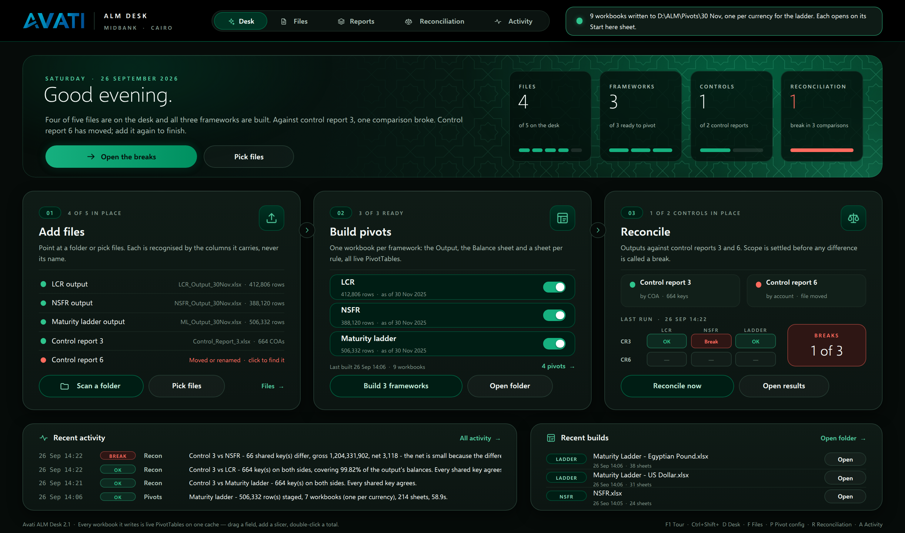

# PivotDesk 2.0

A desk for daily ALM analysis at MIDBANK Cairo. Point it at the LCR, NSFR and
maturity-ladder outputs and control reports 3 and 6; it recognises each file by
its columns, builds one workbook of live PivotTables per framework, and
reconciles the outputs against the control reports.

**2.0 is one application instead of two.** The separate console window is
gone. Everything it did, and the state the sheets used to hold, is on the
**Desk**. While the workbook is in front it runs as an application: the ribbon,
formula bar and sheet tabs step aside, and the Desk fills the window. When
another workbook comes to the front, Excel's chrome is put back as it was.



## Using it

1. Open `dist/PivotDesk.xlsm` and choose **Enable Content**.
2. On the Desk, **Scan a folder** or **Pick files**. You can also click any
   file row to choose the file for that slot.
3. Switch frameworks on or off under **Build pivots**, then build. Each
   framework becomes its own workbook, opening on a *Start here* index.
4. **Reconcile** once a control report is on the desk. The verdict matrix
   shows each control against each framework.

The big button in the hero is always the next sensible step, and the sentence
beside it says why.

| Shortcut | Goes to |
|---|---|
| Ctrl+Shift+D | Desk |
| Ctrl+Shift+F | Files |
| Ctrl+Shift+P | Pivot config |
| Ctrl+Shift+R | Reconciliation |
| Ctrl+Shift+A | Activity |

**Excel view** on the app bar brings the ribbon back while you work in the
workbook. **App view** hides it again.

## What changed in 2.0

- The console (HTA window) was removed. The Desk sheet is the interface.
- App view: Excel's chrome is hidden on the Desk and restored when you leave.
- The Desk design includes a hero with the next action and four KPI tiles,
  live file slots, framework switches, a reconciliation verdict matrix, recent
  activity, and toasts in place of message boxes.
- Files, Reconciliation and Activity share one black app bar with an emerald
  rule. Status cells are shown as pills, rows are banded, the header row is
  frozen, and each sheet is set up for printing.
- Built workbooks use the brand theme, a custom *PivotDesk* pivot style,
  emerald slicers, a redesigned *Start here* sheet, a "‹ Start here" link on
  every sheet, and tab colours by sheet kind.
- **Pivot config.** Every pivot a framework workbook contains is a row you
  can edit: rows, columns, values (any aggregation, or % of row, column or
  total), show-only and hide rules, one sheet per value of a field,
  subtotals, grand totals, layout, repeated labels, sort, widths, number
  format and tab colour. Any of the output's columns can be used, not just
  the thirteen 1.0 staged. The defaults build exactly what 1.0 built. See
  [docs/PIVOT_CONFIG.md](docs/PIVOT_CONFIG.md).
- Seventeen bugs found along the way were fixed. They are listed in
  [docs/PLAN.md](docs/PLAN.md), section R.

The full look-and-feel plan, with a status for every item, is in
[docs/PLAN.md](docs/PLAN.md).

## Design

MIDBANK's mark is black, white and emerald (#009060). PivotDesk uses those
three colours and their tones, plus separate colours reserved for statuses.
The rule is dark chrome, light data: the Desk is dark, and every sheet that
holds balances is white. The hero carries a star-and-cross lattice, the
khatam pattern of Cairo's mashrabiya screens. Type is Segoe UI, which ships
with Windows, so nothing depends on a cloud font.

Every colour pair is measured for WCAG AA contrast by the build
([docs/CONTRAST.md](docs/CONTRAST.md)).

## Building

The workbook is built from source without Excel:

```
python3 build/build.py
```

| Input | Path |
|---|---|
| Seed package | `src/seed/PivotDesk_v1.xlsm` |
| VBA | `src/vba/*.bas`, `*.cls` |
| Desk design | `build/desk.py` (one spec, rendered to DrawingML for Excel and to HTML for previews) |
| Artwork | `build/assets.py` → `design/assets/` |

The build fails on any of these:

- **VBA lint.** Blocks must close. Every identifier must be declared under
  Option Explicit. Every Excel constant must be known. No Public name may be
  declared twice.
- **Shape-name contract.** Every name the VBA paints must exist in the
  drawing, and every OnAction, OnKey and OnTime target must exist.
- **Palette agreement.** The VBA colours must equal the design tokens.
- **WCAG contrast.** Every text run on the Desk and every sheet colour pair
  must pass AA.
- **Package validity.** XML must be well formed, and content types and
  relationships must be complete.

Previews are rendered with the Chromium already on the build machine:

```
python3 build/preview.py            # the Desk: preview/desk-*.png
python3 build/preview_sheets.py     # sheets and a built workbook
```

`build/vbaproj.py` reads and writes the VBA project (MS-OVBA compression and
MS-CFB container). It writes the project source-only, with no compiled
p-code, as the spec requires of a writer. Excel compiles the code on first
open.

## Verification, and what still needs Windows

Checked here:

- the VBA project round-trips byte for byte;
- `olevba` and LibreOffice both read every module of the built workbook;
- LibreOffice renders the Desk drawing from the file;
- the lint, contract, palette, contrast and package checks all pass.

Not checked here: the VBA running inside Excel. There is no Excel off
Windows. The code has been linted and cross-checked, but before anyone relies
on it, open the workbook once on Windows and walk through these steps:

1. Choose Enable Content. The Desk should fill the window and the ribbon
   should hide.
2. Scan a folder, then build one framework, then reconcile.
3. Switch to another workbook. The ribbon should come back.

Items that need this run are marked `[~]` in [docs/PLAN.md](docs/PLAN.md).
