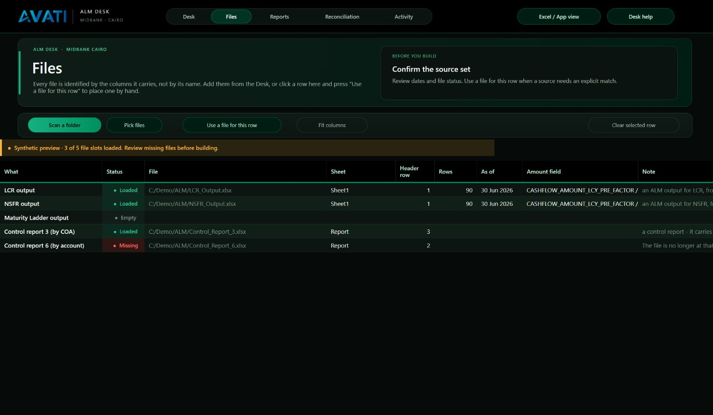
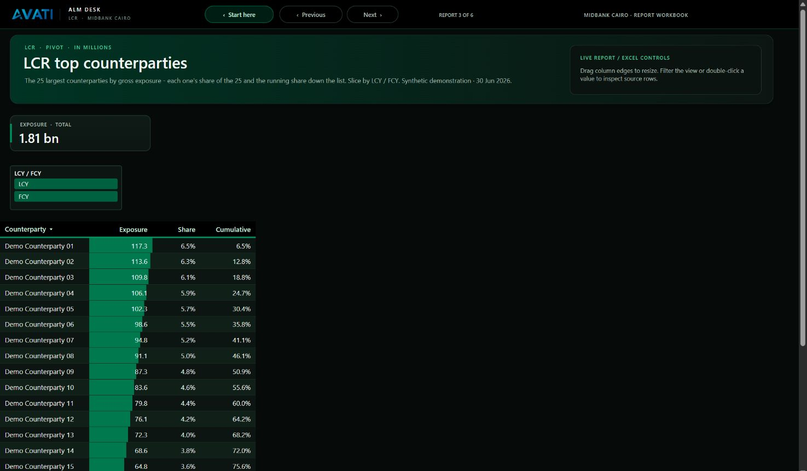

# Avati ALM Desk 3.3

A desk for daily ALM analysis at MIDBANK Cairo. Point it at the LCR, NSFR and
maturity-ladder outputs and control reports 3 and 6. It recognises each file
by its columns, builds workbooks of live PivotTables and PivotCharts for each
framework, and reconciles the outputs against the control reports.

It runs as one application inside Excel. The **Desk** fills the window in App
view; working tables retain row and column handles for resizing. Generated
workbooks keep native Excel controls. **Excel view** restores the full ribbon
and sheet tabs in the application workbook.


## Using it

1. Open `dist/Avati.xlsm` and choose **Enable Content**.
2. On the Desk, **Scan a folder** or **Pick files**.
3. Switch frameworks on or off, then **Build**. Each workbook opens on a
   *Start here* sheet with its figures, its charts and an index of its sheets.
4. **Reconcile** once a control report is on the desk.

What a build makes is set under **Reports**, a tabbed section of five sheets:

| Tab | What it decides |
|---|---|
| **Pivots** | Every pivot sheet: one row per pivot, 32 columns of options ([reference](docs/PIVOT_CONFIG.md)) |
| **Charts** | Every chart: on Start here or on a sheet of its own ([reference](docs/REPORTS.md#chart-config)) |
| **Workbooks** | How many files a framework becomes. The Maturity ladder is one workbook per currency ([reference](docs/REPORTS.md#workbooks)) |
| **Fields** | The output columns the pivots and charts may name, and how their labels read |
| **Gallery** | 18 ready-made reports and charts, each one click from the next build ([reference](docs/REPORTS.md#gallery)) |

The first time the workbook opens, a six-step tour walks through the Desk.
**F1** or the **?** on the app bar plays it again.

| Shortcut | Goes to |
|---|---|
| F1 | The tour |
| Ctrl+Shift+D | Desk |
| Ctrl+Shift+F | Files |
| Ctrl+Shift+P | Pivot config |
| Ctrl+Shift+R | Reconciliation |
| Ctrl+Shift+A | Activity |

**Excel view** on the app bar brings the ribbon back, with an **Avati** tab
first on it. **App view** hides it again.

## What changed in 3.3

Reports now fit their displayed numbers automatically in native Excel. Large
contra balances, precise decimals, long currency formats and date labels can
use the width they need. Row and column handles remain visible on working
tables and generated reports; **Fit columns** is available from relevant
toolbars and the Avati ribbon. Fitting preserves values, totals, filters,
selection, zoom and scroll position.

Secondary pages use a compact 124-point header, one functional toolbar and
34-point wrapped table headings. Everyday actions are separated from reset and
clear actions. Generated titles and metric labels fit their own surfaces,
while linked totals retain their values.

Chart placement reserves all required worksheet rows before drawing. Mixed
sizes on Start here remain separate from the report index; repeated placement
replaces the prior chart group without disturbing unrelated shapes or cells.
Standalone charts reserve enough rows for their full height.

Native Excel acceptance passed **38 pivot/layout assertions**, five narrow-column
fixtures with every `####` display removed, ten mixed-size guide charts and a
520-point standalone chart. The source build passed with **19 modules, 239 Desk
shapes and 0 problems**; all seven focused layout tests passed. These checks use
synthetic fixtures, not full bank-production acceptance. See the
[verification record and reproduction steps](docs/MIDBANK_UI.md#verification).

## What changed in 3.2

The Midbank experience now follows the work from the Desk into the generated
workbooks. The main Desk has a clearer next action, a live operating status,
refined summary cards and a consistent emerald surface hierarchy. Reconciliation
results visibly require a rerun when the source selection changes.

Files, the five Reports pages, Reconciliation and Activity use a more compact
shared header with workflow navigation, contextual help and the primary action.
Generated Start here pages, pivots and standalone chart pages use the same
Midbank report header, summary tiles and navigation. The report index has larger
clickable rows, with both the report name and its description opening the sheet.

Print areas are bounded to report content and visible report artwork. Internal
helper cells stay out of the printed pivots, and generated reports retain the
Midbank colours. The source-defined layout previews use synthetic data by
default. They are design reviews, not screenshots of Excel executing the tool.

The latest Report filters option and top-customer build performance fix are
preserved. Version 3.2 reapplies the shared layout when an older workspace opens.
See [the design coverage and verification record](docs/MIDBANK_UI.md).

## What changed in 3.1

The working sheets now carry the Desk's full layout. Files, all five Reports
pages, Reconciliation and Activity have the same inset emerald hero, star
lattice, rounded workflow cards, prominent next action and elevated toolbar.
The numbered workflow cards navigate between Files, Reports and Reconciliation;
the highlighted card identifies the current section, not completion status.
Excel/App view and Desk help are available from every page. Gallery cards use
the same gradient surface as the Desk.

The update preserves the existing data layout: status remains on row 5,
headings on row 7 and records from row 8. Existing recipes, validation,
reconciliation logic, filters and workbook outputs are unchanged. Version 3.1
triggers the existing one-time restyling on open.



The preview images are generated layout previews, not screenshots from Excel.
The build checks VBA source, shape actions, package integrity, palette and
contrast. Native Excel interaction remains a separate acceptance check.

## What changed in 3.0

**Avati.** The product is Avati ALM Desk. The Avati mark leads every app bar,
on the Desk, on every tool sheet and on every sheet of every workbook a build
writes.

**One look, everywhere.** The Desk's dark emerald theme is now on every
sheet:

- Files, Reconciliation, Activity and all the Reports sheets share the app bar,
  a title block, a toolbar row and a status line. Tables sit on dark banded
  rows with hairlines, and verdicts show as pills.
- The workbook's Normal style is dark, so there are no white cells at the
  edges.

**Built workbooks that read cleanly.**

- Every pivot sheet has the Avati bar, with Start here, Previous and Next.
- Under the title, tiles show each value's live total. They are linked to the
  pivot, so a slicer or a filter moves them.
- Filters sit on rows of their own, clear of the table.
- Pivots use a dark "Avati" style. The +/- buttons are off, and the total row
  reads *Total*.
- Ledger codes are dropped from labels, and names are title-cased where
  Pivot fields says so. *1.07.00.MBGL.1360.LOANS TO CUSTOMERS* reads
  *Loans to Customers*.



**Pivot config: far more customisation.** A row now has 31 columns.

- Values can be shown as:
  - % of row, column, total or parent
  - a running total, or % running total
  - a rank
  - a change or % change from the previous item
  - an index

  Each can run along a field you name, for example
  `Gross pre-factor %running in Counterparty as Cumulative`.
- **Top / value filter**: `Top 25 by Exposure`, `Top 10 Counterparty by Exposure`,
  `Top 5% by Share`, `Exposure > 1m`, `Exposure between 1m and 5m`.
- **Show only / hide** also takes label rules: *contains*, *begins with*,
  *ends with* and their opposites.
- **Group**: dates by year, quarter, month or day, and numbers by a step. The
  grouping is done while staging, so it never breaks the shared cache.
- Presentation options:
  - **Subtotals at** top or bottom
  - **Total label**
  - **Blank line** after groups
  - **Values in** rows or columns
  - **Expand to**: open folded to a level
  - **Units**: thousands, millions or billions
  - **Highlight**: data bars, heatmap, negatives, top N
  - **Tiles** on or off
- New fields:
  - *Gross pre-factor* and *Gross post-factor*: the amounts without their sign.
  - *Calculated* fields worked out by the pivot, such as *Haircut* and
    *Effective factor*.

**Custom charts.** Chart config draws PivotCharts:

- 13 types, from column and bar to doughnut and column + line.
- Categories and an optional series field.
- The same values, filters, groups and top-N as a pivot.
- Placement on Start here in a grid of thirds, halves and full widths, or on
  a sheet of its own.
- Options for labels, legend, units (Auto picks bn, m or k) and three
  palettes.

Each chart is a live PivotChart over the workbook's one cache, so a refresh
redraws it.


**One workbook per currency for the Maturity ladder.**

- Workbooks splits a framework into a file per value of a field. The ladder's
  default is Currency.
- The output is read once and held open. Each workbook stages only its own
  rows, so every total, tile and chart in it belongs to that currency.
- Inside each ladder workbook, the sheets are one per rule, as for LCR and NSFR.
- Prefer one workbook, with the currency picked on each sheet? Clear *One
  workbook per* on the ladder's Workbooks row, and put `Currency` under the new
  **Report filters** column on its Pivot config row
  ([how](docs/PIVOT_CONFIG.md#report-filters)).

**The Gallery.** 18 designed cards:

- top counterparties, counterparty heatmap, product concentration, maturity
  by year, rule ranking, sector league
- currency by bucket, haircut by rule, local/foreign mix, bank counterparties,
  large exposures, balance summary
- six charts

*Add* writes the row switched on. A card already on a sheet offers *Switch on*
or *Open*.


**Removed.** The maturity-gap card, its chart and the gap figures are gone,
as asked. The Desk's bottom right now lists **Recent builds**, each with an
*Open* link.

## Design

- **Colour.** The palette is MIDBANK's black, white and emerald (#009060),
  with its tones, the Avati blue of the mark, and separate status colours.
- **Chart colours.** Every chart palette colour clears 3:1 against the chart
  surface. The build checks this.
- **Data bars** use one emerald (#00794F). It stands out from the rows at
  3.4:1, and white figures on it read at 5:1.
- **Contrast.** Every text and background pair on the Desk and the sheets is
  measured for WCAG AA ([docs/CONTRAST.md](docs/CONTRAST.md)).
- **Type.** Segoe UI, which ships with Windows.

## Building

The workbook is built from source without Excel:

```
python3 build/build.py
```

| Input | Path |
|---|---|
| Seed package | `src/seed/PivotDesk_v1.xlsm` |
| VBA | `src/vba/*.bas`, `*.cls` (19 modules) |
| Desk design | `build/desk.py` (one spec, rendered to DrawingML for Excel and to HTML for previews) |
| Brand | `build/brand.py` → `design/brand/` (the Avati mark, composed from the supplied artwork) |

The build fails on any of these:

- **VBA lint.** Blocks must close, and every identifier must be declared.
  Every Excel constant must be known. No Public name may be declared twice.
  Every call must match its procedure's argument count. The three constructs
  LibreOffice cannot parse are kept out.
- **Excel compile checks** (`build/vbacompile.py`). LibreOffice compiles
  things Excel refuses, and Excel only reports them when a module is first
  used, often mid-build. The check covers:
  - a public name declared in two modules, of any kind;
  - a private member used through its module's name;
  - `ByRef argument type mismatch`;
  - `For Each` over a typed variable;
  - duplicate declarations in one procedure;
  - a Sub used as a value;
  - parentheses around a statement call's arguments;
  - `Exit` of the wrong kind, and `Next` closing the wrong `For`;
  - `GoTo` to a missing label;
  - unknown named arguments.
- **Config agreement.** Every heading named by a default pivot, a default
  chart or a gallery template must be a column of its sheet. The column
  constants must point at the right headings.
- **Shape-name contract, geometry, ribbon, palette.** The VBA and the design
  must agree.
- **WCAG contrast.** This covers the Desk, every sheet pair and every chart
  colour.
- **Package validity.**

Previews are rendered with the Chromium on the build machine:

```
python3 build/preview.py                               # the Desk
LCR_SAMPLE=<lcr sample.xlsx> python3 build/preview_sheets.py   # Files, Recon, Activity, a Balance sheet pivot
CONFIG_ONLY=1 python3 build/preview_sheets.py          # Pivot config, Pivot fields
LCR_SAMPLE=<lcr sample.xlsx> python3 build/preview_v3.py       # Chart config, Workbooks, Gallery, Start here, top counterparties
```

Preview scripts use synthetic examples by default. An explicitly supplied
local sample can drive a private data preview; the Reports previews read their
definitions from the VBA source. HTML previews mirror the design and do not
establish native Excel behavior.

## Verification

Version 3.3 passed the source build gates above and all seven focused layout
tests. Native Excel acceptance on 27 September 2026 generated actual Balance
sheet and Output PivotTables, verified automatic fitting and exercised native
PivotChart placement. It preserved pivot results, an active report filter,
field captions, row/column handles, selection, zoom and scrolling.

To repeat the focused checks, run from this directory:

```
python build/build.py
python build/chart_layout_check.py
python build/layout_acceptance.py --output qa/Avati-Layout-QA.xlsm
```

Use a new QA filename, open that disposable workbook in Excel, enable its
macros and run **PD_LayoutAcceptance**. It writes `layout-acceptance.log` and a
synthetic result workbook beside the QA copy. The optional acceptance modules
are injected only into that copy; they are excluded from `dist/Avati.xlsm`.

This establishes the tested layout behavior, not correctness of every bank
extract, recipe, calculation or printer configuration. Before operational use,
load representative LCR, NSFR and maturity inputs; check currency splits,
configured filters/calculations, control reconciliation and Print Preview.
Confirm that Gallery additions build as intended and that changed source files
require reconciliation to be rerun.

Anything Excel refuses is logged on Activity with the Pivot config or Chart
config row it came from. The rest of the workbook is still built.
