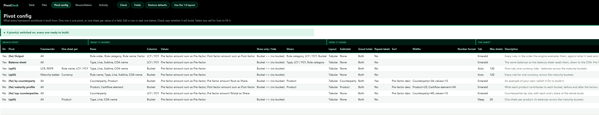
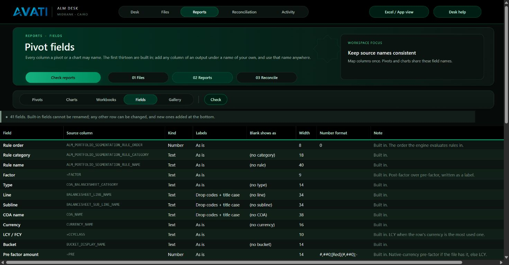

# Pivot config

Every framework workbook PivotDesk builds is described on two sheets:

- **Pivot config**: one row per pivot.
- **Pivot fields**: the columns those rows may use.

Change a row and the next build changes. Nothing about a built workbook is
fixed in code.



## A row

| Column | What it takes | Example |
|---|---|---|
| **On** | Yes or No | Yes |
| **Pivot** | The sheet name. `{fw}` becomes the framework. With *One sheet per*, write `{split}`. | `{fw} Output` → *LCR Output* |
| **Frameworks** | All, or any of LCR, NSFR, Maturity ladder, separated by commas | `LCR, NSFR` |
| **One sheet per** | Optional. One or two text fields. Makes one sheet per value, biggest first. | `Rule name, LCY / FCY` |
| **Rows** | Fields down the side, in order, separated by commas | `Type, Line, Subline, COA name` |
| **Columns** | Fields across the top, separated by commas | `Bucket` |
| **Values** | One or more, separated by `;` (see below) | `Pre factor amount sum as Pre-factor` |
| **Show only / hide** | Item rules, separated by `;` (see below) | `Bucket <> (no bucket)` |
| **Slicers** | Fields to put slicers on, separated by commas | `Type, LCY / FCY` |
| **Layout** | Tabular, Outline or Compact | Tabular |
| **Subtotals** | None, All, or the row fields to subtotal | `Type, Line` |
| **Grand totals** | Both, Bottom row, Right column, None | Both |
| **Repeat labels** | Yes or No | No |
| **Sort** | Blank, `label asc` / `label desc`, or a value caption followed by `asc` / `desc` | `Pre-factor desc` |
| **Widths** | `field=width` and `values=width`, separated by `;` | `COA name=44; values=16` |
| **Number format** | Any Excel format. Blank uses `#,##0;[Red](#,##0);-`. | `#,##0.00` |
| **Tab** | Auto, Emerald, Deep, Slate, Black | Auto |
| **Max sheets** | For *One sheet per*: how many sheets at most. Default 120. | 60 |
| **Description** | Shown under the title and on *Start here* | |
| **Check / What to fix** | Written by **Check** | |

Select any cell on the sheet and Excel shows what goes in it.

### Values

Each value is written as: `field` `aggregation` `as caption`.

- The aggregation is optional and defaults to `sum`. The options are `sum`,
  `count`, `average`, `max` and `min`, plus `%row`, `%col` and `%total` (a
  sum shown as a share of its row, column or grand total).
- The caption is optional. Without one, the value is called *Sum of …*.
- Text fields can only be counted: `Account count as Accounts`.

```
Pre factor amount sum as Pre-factor; Post factor amount sum as Post-factor
Pre factor amount %col as Share of bucket
Account count as Accounts
```

### Show only / hide

- `Field = a | b | c` shows only those items.
- `Field <> a | b` hides them.
- Separate several rules with `;`.

If the field is on the rows or columns, the rule filters that axis.
Otherwise it becomes a report filter at the top of the pivot.

```
Bucket <> (no bucket)
Type = Asset | Liability; Data source <> GL
```

Blank cells show as the field's *Blank shows as* label, for example
`(no bucket)`. That label is a real item, so it can be hidden reliably.

### One sheet per

With `One sheet per = Rule name, LCY / FCY`, PivotDesk makes one sheet for
each rule-and-side pair found in the data:

- Pairs appear biggest rule first, and a rule's LCY and FCY sheets sit side
  by side.
- A pair with no rows gets no sheet. (1.0 made one anyway, and its filter
  silently showed all the data.)
- Rows with no value, such as *(no rule)*, get no sheet of their own. They
  are still in the overview pivots.
- Slicers are not added to these sheets, because one slicer would filter
  every sheet in the family at once.

## The defaults

The four rows PivotDesk ships with build exactly what 1.0 built:

| On | Pivot | Frameworks | One sheet per | Rows | Columns | Values |
|---|---|---|---|---|---|---|
| Yes | `{fw} Output` | All | | Rule order, Rule category, Rule name, Factor | LCY / FCY | Pre-factor; Post-factor |
| Yes | Balance sheet | All | | Type, Line, Subline, COA name | LCY / FCY | Pre-factor |
| Yes | `{split}` | LCR, NSFR | Rule name, LCY / FCY | Type, Line, Subline, COA name | Bucket | Pre-factor |
| Yes | `{split}` | Maturity ladder | Currency | Rule name, Type, Line, Subline, COA name | Bucket | Pre-factor |

Four more ship switched off, ready to turn on:

| Pivot | What it is |
|---|---|
| `{fw} by counterparty` | Counterparty by product across buckets, with each counterparty's share of the bucket, biggest first |
| `{fw} maturity profile` | What each product contributes to each bucket, before and after the factors, subtotalled by product |
| `{fw} top counterparties` | Counterparties by size, LCY against FCY, with each one's share of the whole book |
| `{split}` by Product | One sheet per product: its balances across the maturity buckets, at most 20 sheets |

## Recipes worth having

```
Pivot             {fw} maturity profile
Rows              Product, Cashflow element
Columns           Bucket
Values            Pre factor amount sum as Pre-factor; Post factor amount sum as Post-factor
Show only / hide  Bucket <> (no bucket)
Subtotals         Product
Sort              Pre-factor desc
```

```
Pivot             {fw} top counterparties
Rows              Counterparty
Columns           LCY / FCY
Values            Pre factor amount sum as Pre-factor; Pre factor amount %total as Share
Sort              Pre-factor desc
Widths            Counterparty=40
```

```
Pivot             {split}
One sheet per     Product
Rows              Type, Line, COA name
Columns           Bucket
Values            Pre factor amount sum as Pre-factor
Max sheets        20
```

## Pivot fields



The first thirteen fields are built in. They are the columns 1.0 always
staged, and the classic layout depends on them, so they cannot be renamed.

Every other row names a column of the output:

| Column | What it holds |
|---|---|
| **Source column** | The header in the file. Case and punctuation do not matter. |
| **Kind** | Text, Number or Date |
| **Blank shows as** | The label for empty cells |
| **Width** | The column width when the field is on the rows |
| **Number format** | For Number and Date fields |

Only the fields a recipe actually uses are staged, so an unused field costs
nothing. If a file lacks a field's column, the field is staged blank and the
*Start here* sheet says so.

## Check, and the safety net

- **Check** reads every row. It writes *OK* or *Break* beside each one, with
  the reason in words that point at the cell to change.
- A build runs the same check first. If any row that is on will not build,
  the build stops before it starts.
- If a recipe ever gets in the way of a deadline, **Use the 1.0 layout**
  builds exactly what 1.0 built, whatever the sheet says. **Build from this
  sheet** switches back. Recipes are kept either way.
- **Restore defaults** puts both sheets back to the four rows above.
