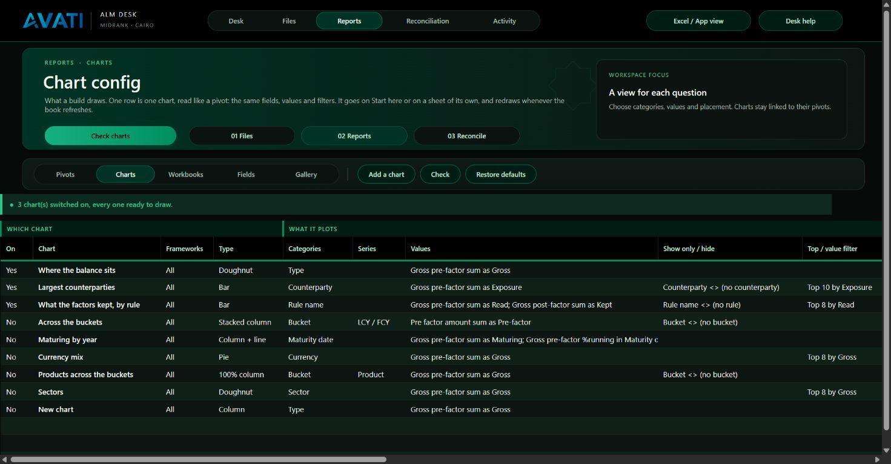
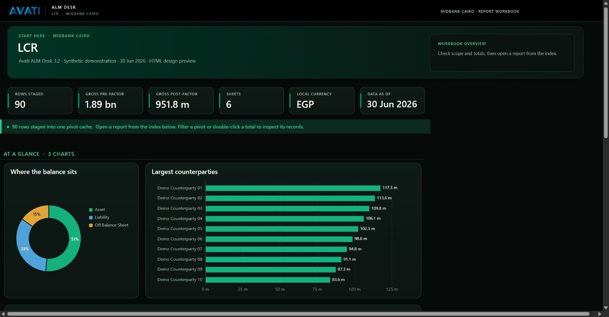
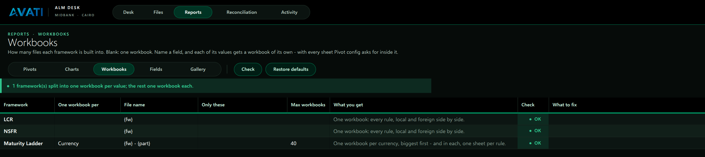
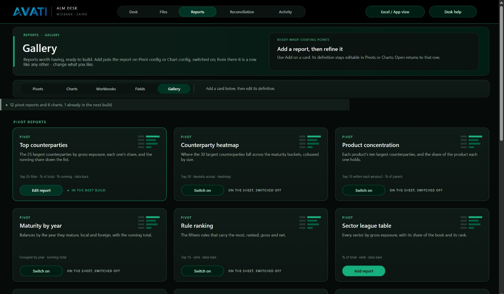

# Charts, Workbooks and the Gallery

Three of the five **Reports** tabs. The other two, Pivots and Fields, are
described in [PIVOT_CONFIG.md](PIVOT_CONFIG.md).

## Chart config

One row is one chart. It is read like a pivot recipe, with the same field
names, values, filters, groups and top-N. Underneath, it is a pivot: each
chart gets its own PivotTable on the workbook's hidden `_chart` sheet, over
the one cache every sheet shares, and is drawn as a PivotChart of it. A
refresh redraws every chart along with every sheet.

| Column | What it takes | Default |
|---|---|---|
| **On** | Yes or No | |
| **Chart** | The title. `{fw}` becomes the framework. On its own sheet, it is the sheet's name too (31 characters at most). | |
| **Frameworks** | All, or any of LCR, NSFR, Maturity ladder | All |
| **Type** | Column, Stacked column, 100% column, Bar, Stacked bar, 100% bar, Line, Line with markers, Area, Stacked area, Pie, Doughnut, Column + line | Column |
| **Categories** | The field the chart runs along: the x axis, or the slices of a pie. Two fields make a nested axis. | |
| **Series** | Optional. A field that splits each category, one colour per value. It takes one value, and is not used on a pie. | |
| **Values** | As on Pivot config, separated by `;`. Each value is one series. | |
| **Show only / hide** | As on Pivot config | |
| **Top / value filter** | As on Pivot config. It filters the categories. | |
| **Group** | As on Pivot config | |
| **Sort** | As on Pivot config. `Exposure desc` puts the biggest first. | The data's order (buckets by tenor) |
| **Where** | Start here, or Own sheet | Start here |
| **Size** | On Start here: Third, Half, Two thirds, Full | Half |
| **Labels** | None, Values, Percent, Both. Percent and Both are for a pie or doughnut. | None |
| **Legend** | Auto, Top, Right, Bottom, None. Auto means none for one series, top for several, right for a pie. | Auto |
| **Units** | Auto, As is, Thousands, Millions, Billions. Auto picks from the biggest figure plotted: 93,322,000,000 reads *93.3 bn*. | Auto |
| **Colours** | Avati (emerald, sky, amber, mint, coral, violet, sand, slate), Emerald (shades of the brand), Two tone (emerald and sky) | Avati |
| **Description** | Under the title on its own sheet; in the index | |

**Column + line** takes two values: the first as columns, the second as a
line on its own axis. A value shown as a share (`%running`, `%total`) gets a
percent axis.

**On Start here**, charts fill a grid under the book's tiles, left to right,
wrapping when a row is full. They sit above the index of sheets.

**Drawn in the Desk's colours**:

- the dark surface with a hairline edge;
- the title at the top left;
- a hairline grid, and no axis line;
- no field buttons;
- a gap between slices, not an outline;
- bars in a bar chart read top down, biggest first.

The build checks that every palette colour clears 3:1 against the surface.

**The defaults**. Three charts are switched on:

| Chart | Type | Plots |
|---|---|---|
| Where the balance sits | Doughnut, a third | Gross pre-factor by balance-sheet Type, percent labels |
| Largest counterparties | Bar, two thirds | The 10 biggest counterparties by gross, blanks hidden |
| What the factors kept, by rule | Bar, full width | The 8 rules that read the most: gross pre-factor (read) against gross post-factor (kept) |

Five more are switched off:

- Across the buckets (stacked, LCY / FCY)
- Maturing by year (column + line, own sheet)
- Currency mix (pie)
- Products across the buckets (100% column, own sheet)
- Sectors (doughnut)

**Add a chart**, **Check**, **Restore defaults** and the live status-bar
check work as they do on Pivot config. A chart Excel refuses is logged on
Activity with its row, and the workbook is built without it.

## Workbooks

One row per framework says how many files a build writes for it.

| Column | What it takes | Default |
|---|---|---|
| **One workbook per** | Blank for one workbook, or a text field | Blank for LCR and NSFR; *Currency* for the Maturity ladder |
| **File name** | `{fw}` is the framework and `{part}` the value. With One workbook per, `{part}` must be in it. | `{fw}`; `{fw} - {part}` |
| **Only these** | Optional. The values to build, separated by `\|` | Every value, biggest first |
| **Max workbooks** | The most workbooks to make. The smallest values past it are left out, and Activity names them. | 40 |
| **What you get** | A note | |

**How a split build runs**:

1. The output is read once, and every value of the field is found, with its
   gross amount.
2. The output is held open.
3. For each value, biggest first, a new workbook stages only that value's
   rows. Every total, tile, chart and sheet in it belongs to that value.
4. Inside each workbook, Pivot config and Chart config apply as usual. The
   ladder's default recipe makes one sheet per rule in each currency's book,
   as for LCR and NSFR.

A value that is the field's blank label, such as *(no currency)*, gets no
workbook. The local currency is still decided from the whole output, so
*LCY / FCY* means the same in every workbook.

**One workbook, with the currency picked on each sheet instead**: leave *One
workbook per* blank on the ladder's row, and put `Currency` under **Report
filters** on the ladder's Pivot config row. See
[PIVOT_CONFIG.md](PIVOT_CONFIG.md#report-filters).

The 1.0 layout always builds one workbook per framework. Workbooks says so
beside a split row while the 1.0 layout is switched on.

## Gallery

Eighteen designed cards. Each is a finished Pivot config or Chart config row
that shows what the configuration can do:

| Card | What it shows off |
|---|---|
| Top counterparties | Top 25, % of total, % running, data bars, a slicer |
| Counterparty heatmap | Top 30 across the buckets, heatmap |
| Product concentration | Top 10 within each product, % of parent, blank lines |
| Maturity by year | Group by year, running total |
| Rule ranking | Top 15, rank |
| Sector league table | % of total, rank, data bars on one value |
| Currency by bucket | Heatmap across buckets |
| Haircut by rule | Calculated fields, top 20 by the haircut |
| Local and foreign mix | % of row, outline, subtotals on top |
| Bank counterparties | A label rule: Counterparty contains BANK |
| Large exposures | A value filter (> 100m), folded to open onto products |
| Balance sheet summary | Outline, subtotals on top, expand to Line, blank lines |
| Currency mix, Across the buckets, Maturing by year, Products across the buckets, Sectors, Haircut by rule category | The six charts |

The card's button depends on what is on the sheets:

- **Add** writes the row, switched on, and opens it.
- **Switch on** turns on a row that is already on the sheet but off.
- **Open** goes to a row that is already on.

The Gallery is repainted each time you open it. From then on the row is
ordinary: change it like any other.
