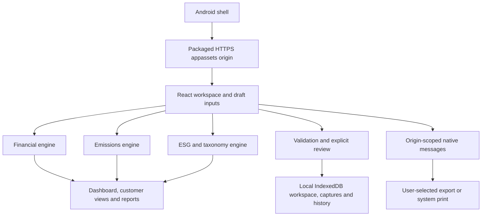

# Architecture and analytical model map

This edition packages the ESG Banking demonstration as an offline Android application. The React interface and three calculation engines run locally. The Android shell supplies the WebView, document picker, file export and print integration. There is no synchronization with the separately supplied cloud-reference application.

## Package map

| Directory | Responsibility |
|---|---|
| `android/` | Native shell, manifest, resources and Android build configuration. |
| `web/` | React application, styles, model inputs, calculation engines and local persistence adapter. |
| `scripts/` | Build and packaging helpers; consult the root README for verified commands. |
| `docs/` | Architecture, data contract, release procedures and limitations. |
| `cloud-reference/` | Original cloud implementation for reference; not a runtime dependency of the APK. |
| `framework/` | Research framework and offline HTML reading copy. |

The interface has nine workspaces: Overview, Customers, Scenario lab, Capital & earnings, Emissions, Evidence & actions, Taxonomy, Reports and Data workspace. They share one portfolio; each view is not a separate copy of the customer data.

## Runtime boundary

The native host is `android/app/src/main/java/com/esgbanking/workbench/MainActivity.java`. Its minimum is Android 9 / API 28, with Android System WebView 111 or later and the required bridge/browser features checked at startup. Assets are loaded under `https://appassets.androidplatform.net/assets/www/`. This is a local asset origin, not an Internet-hosted application. The manifest declares no Android `INTERNET` or broad storage permission. User-initiated external HTTPS research links leave the analytical WebView for the user's browser and may require connectivity there.

The native bridge is named `ESGNative`. Its listener permits only the exact appassets origin and the main frame, with bounded document-export and print operations. Unhandled/off-origin resource requests are blocked. File-URL access, mixed content, arbitrary browser permissions and automatic windows are disabled. Imported documents are bounded copies exposed through a nonexported FileProvider to the existing file-input workflow; they are never navigated to as privileged web content. The Android release record must distinguish source inspection/build checks from tests actually performed on a device; see [validation limits](VALIDATION_AND_LIMITATIONS.md).

`web/lib/offline-store.ts` owns IndexedDB persistence for the saved workspace, immutable scenario captures and local history. `web/lib/platform.ts` supplies native export/print requests and `components/platform-status.tsx` shows their outcomes. React holds the working draft. Save and explicit review advance the saved revision; editing an input or loading a captured run only changes the draft. A calculation does not itself save anything.

## Shared data and units

`web/lib/workspace.ts` defines the workspace envelope and validation. The default model version is `2026.09 · 1.0`. Defaults contain 24 borrowers, 36 facilities, 48 physical-risk sites and 30 emissions entities. All initial financial values, factors, evidence references and reviewer identities are synthetic.

Amounts are USD millions unless a field explicitly says otherwise. Facility `drawnLocalm` and `undrawnLocalm` are millions in the facility currency; `settings.fxUSDPerUnit` converts one local currency unit to USD. Emissions are tonnes CO2e; factors are kg CO2e per specified activity unit. Ratios and probabilities use decimal fractions. An empty numeric field is `null`, not zero.

Shared borrower/facility/site masters and the reporting date are authoritative across all engines. Changing FX or a facility balance changes financial exposure, financed-emissions attribution and taxonomy allocation limits together. Changing the selected credit stress scenario does not rewrite the historical emissions inventory. Egypt is the default bank profile; Jordan, UAE and Global are available. Country selection retains all portfolio markets and does not insert unverified regulatory minima or recalibrate tax rates.

## Financial transmission

Implementation: `web/lib/financial.mjs`; defaults: `financial_defaults.mjs`.

1. Scenario paths change demand, carbon/energy cost, interruption, repairs and transition investment. Physical-site shares connect borrower revenue and collateral to hazard, vulnerability, adaptation and insurance inputs.
2. Available cash and debt-service coverage feed an explicit PD sensitivity; physical loss changes LGD. These are illustrative transmission assumptions, not statistically estimated bank models.
3. Facility schedules model amortization, drawings, maturity, specified default timing, discounted recoveries, write-offs, allowances and undrawn provisions. Defaults are scheduled assumptions; a forecast PD does not automatically trigger a realized default.
4. Interest, credit charges, funding cost, expenses, market/operating losses and tax flow into retained earnings, cash and the balance sheet. Approved, evidenced management actions can add equity/funding and fees. The five-year schedule exposes reconciliations and before/after-action measures.
5. Credit RWA, fixed market/operational RWA inputs, capital deductions and capital instruments yield CET1, Tier 1, total-capital and headroom outputs. HQLA/outflow and ASF/RSF calculations are liquidity planning proxies.

Reporting ECL is a separate probability-weighted calculation using the configured accounting cases, staging, lifetime/12-month horizon and recovery timing. It is not the selected stress case relabelled as accounting ECL. The model demonstrates these connections; it is not a complete IFRS 9 implementation or a regulatory capital/liquidity filing engine. Existing loans run off; new originations are not assumed.

## Emissions accounting

Implementation: `web/lib/emissions.mjs`; inputs/reference: `emissions-reference.json`.

| Lending boundary | Attribution denominator in implemented route |
|---|---|
| Listed corporate | EVIC from the shared borrower record. |
| Private corporate | Nonnegative book equity plus debt from the shared borrower record. |
| Project finance | Nonnegative project equity plus project debt, specific to the project. |
| Commercial real estate, mortgage or motor | Original asset value, or a documented fixed fallback value. |

Actual drawn exposure is the numerator. Undrawn amounts, CCF and stressed credit EAD are not financed-emissions attribution amounts. Class, purpose, entity, evidence, period and denominator gates must pass. Corporate and designated-asset overlap is flagged for review rather than silently deduplicated.

Each scope selects reported emissions **or** complete eligible activity data. Factor matching checks the unit, activity, scope, country and period. Unsupported estimation routes stay pending. Scope 1, Scope 2 and investee Scope 3 have separate exposure coverage and data-quality outputs. Combined Scope 1+2 includes only facilities with both scopes ready. Known subtotals must remain beside coverage; `displayFinanced*` fields distinguish no coverage from measured zero.

Bank operations retain separate location-based and market-based Scope 2 totals. Contract criteria, retirement evidence and the residual-mix/grid-fallback rules govern the market-based route. These alternative totals must not be added; their difference is not a claim of physical abatement. `completeScope*` fields are unavailable when the relevant controlled inventory is incomplete. The 15-category bank Scope 3 register links Category 15 to the modeled lending inventory while retaining investee Scope 3 separately. Offsets, avoided emissions, facilitated emissions and insurance-associated emissions are not silently folded into this route.

## ESG decisions and taxonomy

Implementation: `web/lib/esg.mjs`; rules/reference: `esg-reference.json`.

Management scores are distinct from E&S decisions. A prohibition, critical unresolved E&S action or missing diligence/evidence can hold or decline a case despite a strong score. Scores do not mechanically change PD or RWA.

Taxonomy technical criteria, safeguards, allocation, review and claim approval are separate checks. Jordan 2026 and internal demonstration criteria are distinct schemes. A comparison selection cannot inherit an approval from another scheme. Readiness organizes jurisdiction-specific requirements and evidence; it does not certify compliance or turn internal target dates into regulatory deadlines.

Review fingerprints detect relevant record changes. They are not digital signatures, authenticated reviewer credentials, documentary verification or external assurance. The full source hierarchy and methodological context remain in the bundled framework.
