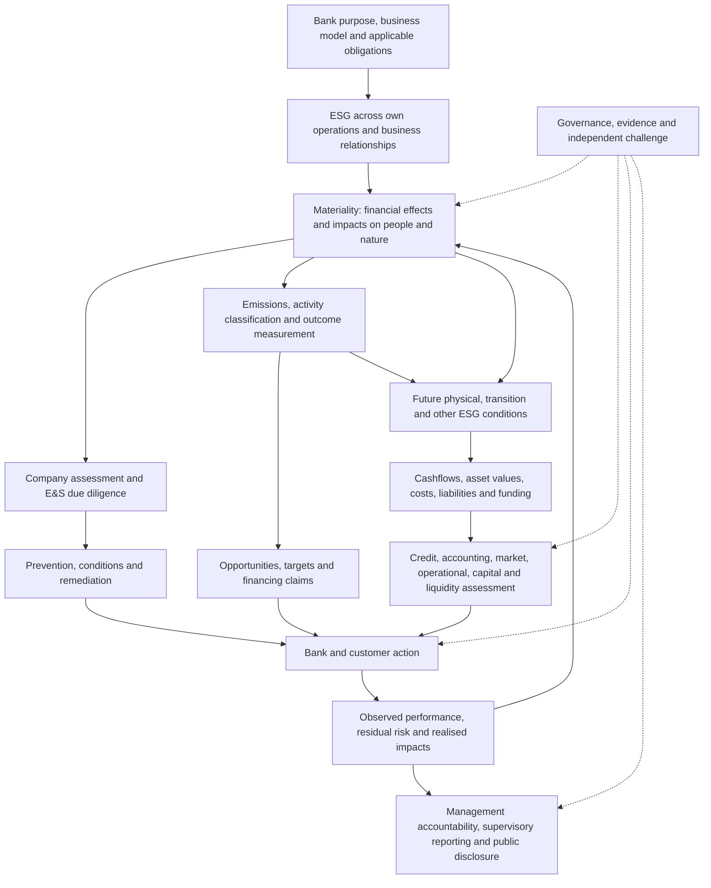
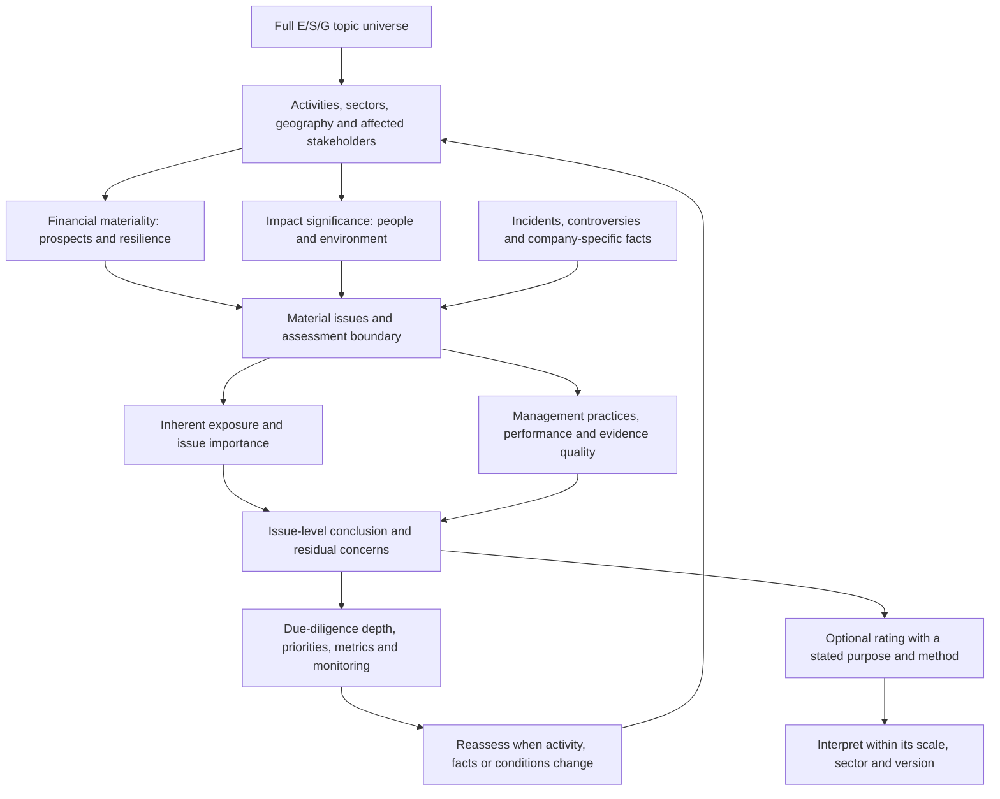
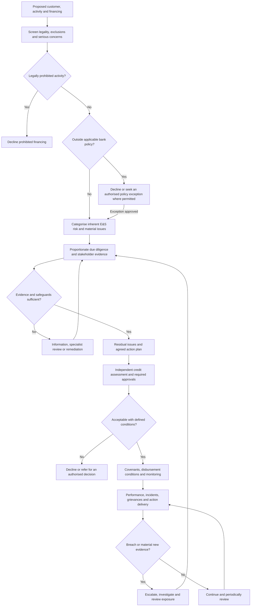
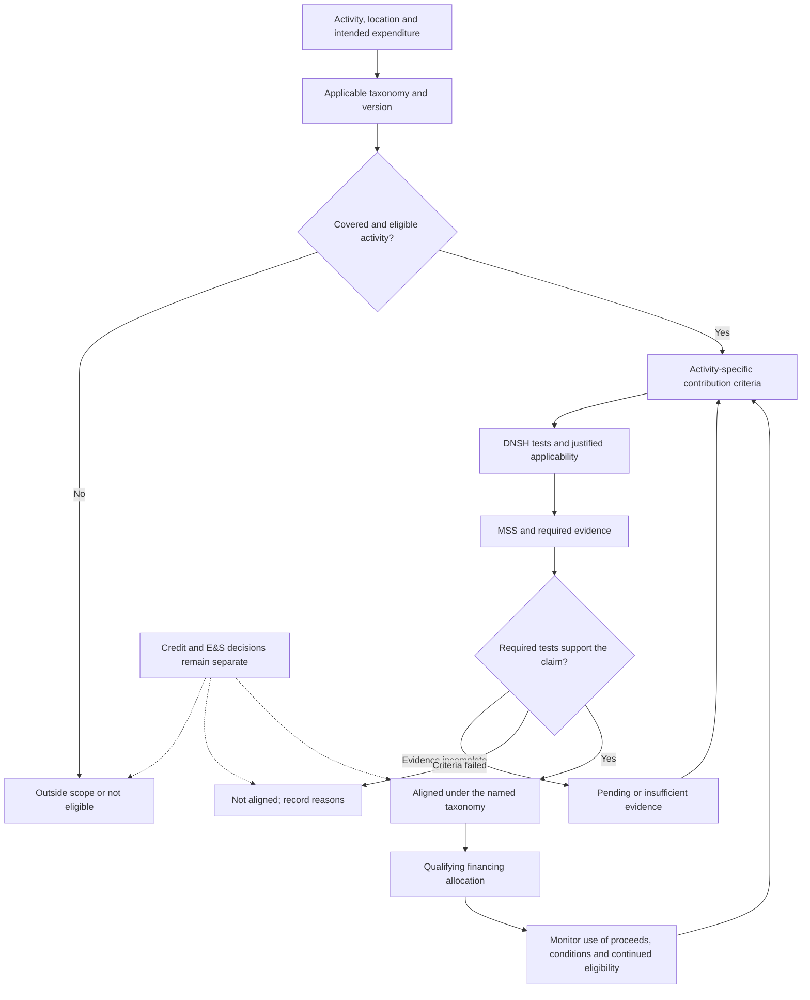
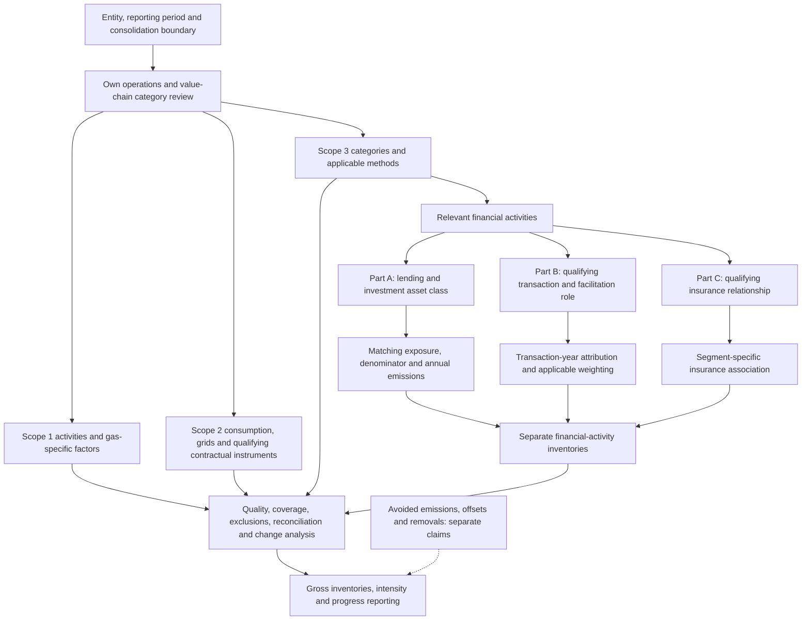
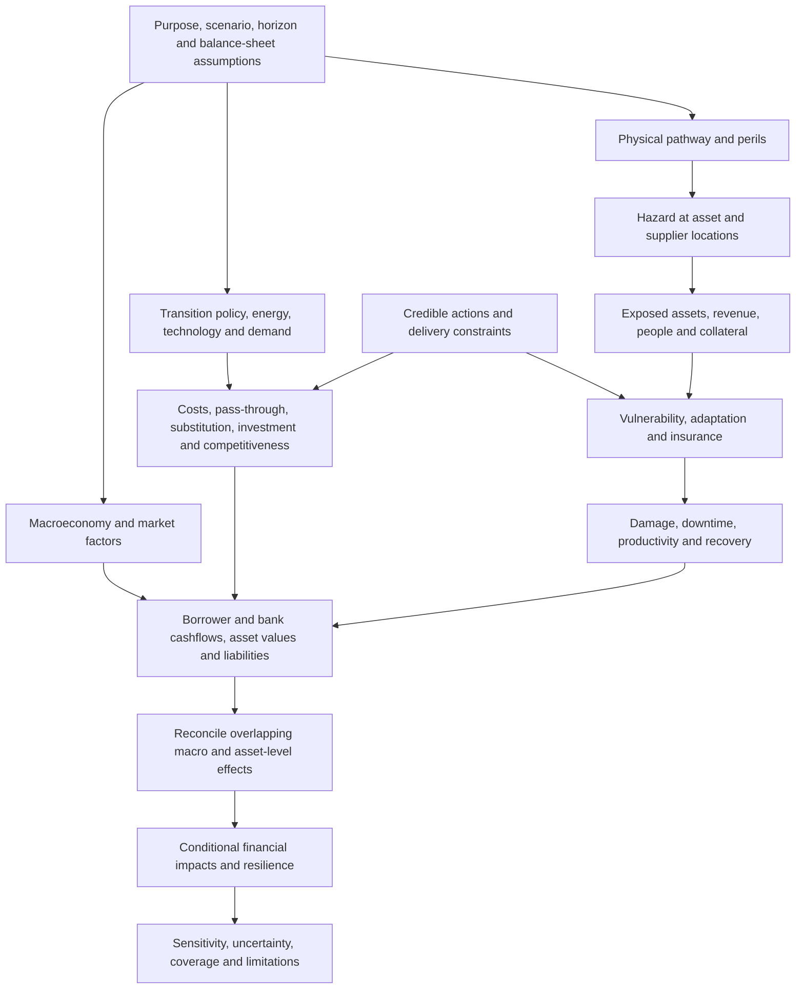
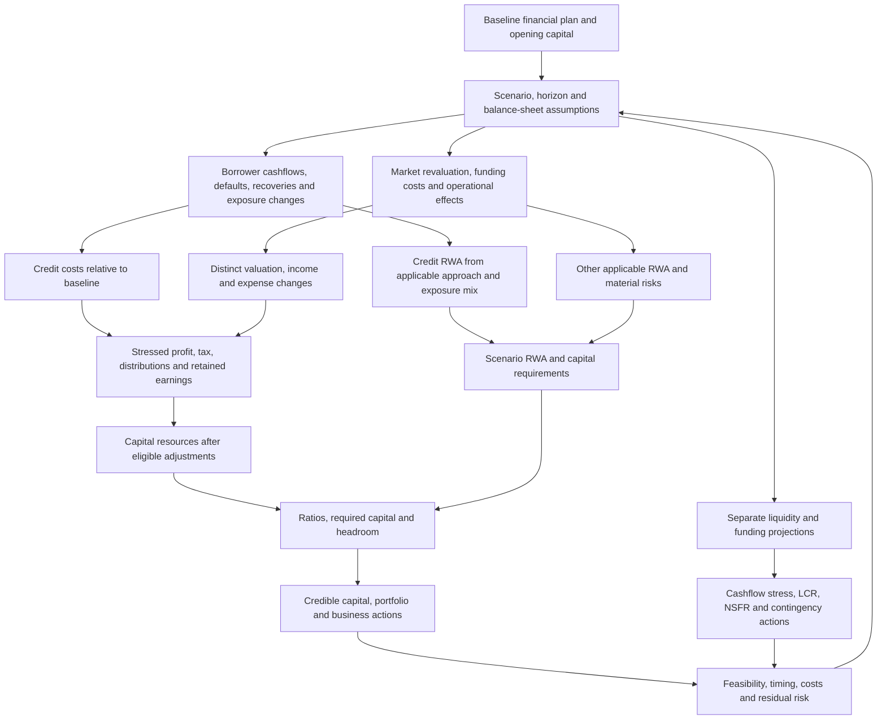
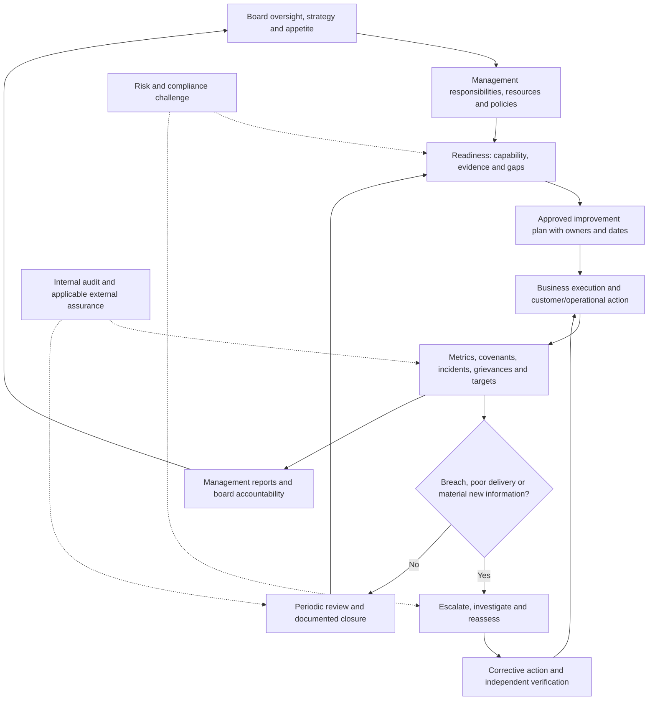
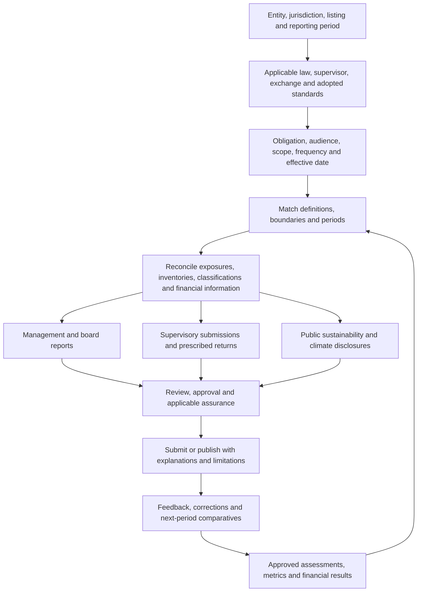
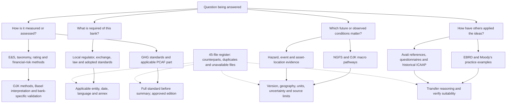

# ESG in banking: an integrated conceptual framework

Version 2 · 25 September 2026

ESG is the discipline through which a bank understands environmental, social and governance matters, manages its relationships with people and the environment, assesses the resulting risks and opportunities, and demonstrates what it has done. It applies to the bank's own business and to lending, investments, capital-markets activities and other relevant relationships.

This framework gives ESG the clarity of purpose and connections that a bank expects from capital adequacy, IFRS 9 or liquidity management. It explains the subject: what must be understood, what is measured, how conclusions are reached, and how those conclusions affect decisions. It synthesises the supplied research; it is not a single regulator-issued ESG standard.

The central principle is **connected evidence, distinct conclusions**. A customer's ESG management assessment, E&S acceptability, activity taxonomy alignment, emissions, scenario resilience and credit quality answer different questions. Each can influence the others through a documented relationship. None substitutes for all the others.

## Reading map

| Part | Question answered |
|---|---|
| 1–2. Scope and materiality | What is ESG, whose activities are covered, and which issues matter? |
| 3–5. Assessment, E&S decisions and taxonomy | How are companies, impacts and financing activities assessed? |
| 6. Emissions accounting | What is emitted, by whom, and what share is associated with the bank? |
| 7–8. Scenarios and financial transmission | How could ESG developments affect cashflows, losses, capital and liquidity? |
| 9–11. Strategy, governance and disclosure | What should the bank do, who is responsible, and what must be communicated? |
| 12. Connected customer example | How do the methods work together? |
| 13–14. Source hierarchy and complete material map | What does each of the 45 supplied files contribute, and what authority does it have? |

PDF locators refer to physical pages, including covers. Source IDs link to the individual entries in Part 14. The ten flowcharts explain ESG concepts and relationships.

## 1. What ESG covers

### Three dimensions and two business boundaries

| Dimension | Matters to assess | Bank's own business | Financed and other business relationships |
|---|---|---|---|
| Environmental | Climate mitigation/adaptation; energy; water; pollution; waste/circularity; land, ecosystems and biodiversity | Buildings, data centres, vehicles, purchasing, resource use and operational resilience | Borrower operations, projects, investees, collateral, supply chains and environmental impacts |
| Social | Labour/human rights; safety; communities; inclusion; accessibility; customer treatment; privacy | Employees/contractors, working conditions, fair lending, suitability, complaints and customer data | Labour and supply-chain practices, land rights/displacement, community safety and vulnerable groups |
| Governance | Oversight, accountability, ownership, integrity, corruption, tax transparency, incentives and controls | Board/management responsibilities, risk culture, conduct, compliance, remuneration and assurance | Counterparty ownership, integrity, competence, controls and credibility of commitments |

Climate is one environmental topic. The library develops its quantitative methods more deeply than most other E/S/G topics. That difference does not reduce ESG's scope: water scarcity, biodiversity loss, worker injury, unfair lending, privacy failures and corruption can be material independently of climate. Governance is both a subject within the G pillar and the responsibility/control structure supporting all ESG decisions. [S24](#s24), [S13](#s13), [S44](#s44).

### Four connected perspectives

| Perspective | Main question | Typical conclusions |
|---|---|---|
| Financial risk and resilience | How can ESG affect cashflows, values, funding or the business model? | Credit deterioration, vulnerable collateral, concentration, disruption and funding needs |
| Impacts | What effects arise on people and the environment through operations and relationships? | Pollution, labour harm, biodiversity pressure, exclusion, privacy harm or beneficial outcomes |
| Opportunities and transition | Which changes can improve outcomes while meeting commercial/risk objectives? | Adaptation finance, efficiency, inclusion, new services and customer transition |
| Accountability | Which obligations and commitments apply, and what evidence supports performance? | Governance, due diligence, action plans, reporting and assurance |

Financial materiality concerns sustainability-related risks and opportunities that could affect the entity's prospects. Impact materiality concerns significant effects on the economy, environment and people. This framework retains both perspectives for management; the chosen reporting regime determines what must be disclosed. It does not imply the same double-materiality mandate for every bank. [IFRS S1](https://www.ifrs.org/issued-standards/ifrs-sustainability-standards-navigator/ifrs-s1-general-requirements/), [GRI 3](https://www.globalreporting.org/publications/documents/english/gri-3-material-topics-2021/).

### Flowchart 1 — How the whole subject connects

The path to a financial model passes through an economic effect. An exclusion, human-rights concern, reporting requirement or taxonomy condition may instead lead directly to a policy or disclosure decision without a quantified loss.

## 2. Boundaries, evidence and materiality

### Establish the unit of analysis

A bank group may disclose a consolidated inventory while a local subsidiary submits a prudential return. One borrower can have many activities, sites and loans. A qualifying project does not make every activity of its parent green; one flooded site does not imply equal damage to all the parent's assets.

| Object | Why it matters | Essential relationships |
|---|---|---|
| Bank entity/group | Responsibility, consolidation and obligation scope | Subsidiaries, jurisdictions, business lines and reporting perimeter |
| Counterparty/group | Business model, governance, inventory and financial position | Ownership, activities, suppliers and customers |
| Activity/project | Technical sustainability criteria and specific impacts | Sector, technology, use of proceeds and project boundary |
| Loan/investment/exposure | Financial risk, attribution and contractual rights | Obligor, amount, currency, tenor, commitments and security |
| Site/asset/collateral | Physical exposure, vulnerability and recovery value | Location, peril, asset type, value basis and insurance |
| Evidence/assessment | Supportability and comparability | Source, date, period, method, assessor, limitations and approval |
| Action/target | Responsibility and progress | Baseline, owner, funding, milestones, dates and verified results |

Keep units, currency, period, geography and scope explicit. Distinguish measured, estimated and proxy data; missing, not assessed and not applicable are different states. Reconcile financial balances, emissions boundaries and financing allocations to their source records. [S14](#s14), [S19](#s19), [S26](#s26), [S31](#s31).

### Materiality determines depth

Start with the full E/S/G universe. Use activities, sector/geographic concentrations, stakeholder evidence, incidents, external conditions and horizons to identify material matters. Assess inherent exposure separately from management capability and residual risk. Low historical losses do not establish low future climate risk; a policy alone does not establish effective implementation.

Financial materiality requires plausible channels to revenue, costs, investment, cashflows, asset values, liabilities and financing. Consider magnitude, likelihood where meaningful, time horizon and concentration. For impacts, distinguish actual/potential and negative/positive effects, assess severity, affected groups and the bank's relationship to the impact; likelihood also matters for potential negative impacts. Human-rights impacts warrant appropriate priority. Unrelated benefits should not cancel serious harm. [GRI 3 material-topic process](https://www.globalreporting.org/publications/documents/english/gri-3-material-topics-2021/).

Sector relevance should be explicit. Cement may emphasise carbon, energy, air pollution, water and safety; agriculture may emphasise water, land, biodiversity, labour and hazards; banking may emphasise conduct, inclusion, privacy, governance and financed impacts. These are inquiry priorities, not universal weights. A severe company-specific issue can remain material regardless of its sector's typical weight. [S24](#s24), pp. 10–13; [S14](#s14), pp. 35–38.

### Flowchart 2 — From topics to a meaningful assessment

## 3. ESG assessments and ratings

An assessment describes issue-specific exposure, management and performance. A rating compresses selected conclusions into a scale. Its meaning depends on its purpose: management quality, financial resilience, impacts or a defined combination. Retain the underlying findings and limitations.

The supplied MSCI method assesses **industry-relative resilience to financially relevant ESG risks and opportunities**. Material-issue selection, exposure, management, controversies, opportunities, governance and peer adjustment are separate stages. Its grade is not an absolute environmental-benefit measure, taxonomy result or default probability; its proprietary weights and formulas are not universal bank standards. [S24](#s24), pp. 4–5, 17–27, 32–34, 43–44.

- **Exposure versus capability:** a high-exposure business may need stronger management for an acceptable residual position; low exposure alone does not establish good practice.
- **Practice versus performance:** policies and targets need resources, delivery, results and evidence.
- **Risk versus opportunity:** exploiting an inclusion or clean-technology opportunity differs from controlling harm.
- **Missing evidence versus poor performance:** non-disclosure creates uncertainty but does not always establish the worst outcome; treatment must be method-specific and transparent.

Adverse news triggers investigation and reassessment. Evaluate the nature, scale, credibility and status of harm, the organisation's response and remaining risk. Allegation, established finding, remediation and verified resolution are different states. Serious unresolved issues need explicit escalation; a favourable aggregate score must not conceal them. [S24](#s24), pp. 18–21; [S01](#s01).

## 4. Environmental and social risk management in financing

E&S risk management establishes whether and under what conditions a relationship or transaction is acceptable. It includes legality, permits, pollution, labour, safety, land, communities, biodiversity, human rights and grievances. The CBE reference provides a complete lifecycle; its obligations remain jurisdiction-specific. [S01](#s01).

### Flowchart 3 — E&S decisions through the financing lifecycle

Categorisation determines investigation depth, expertise and approval level; it is distinct from a credit grade. An action plan identifies the concern, corrective action, owner, resources, deadline and closure evidence. Financing conditions distinguish safeguards needed before disbursement from improvements permitted over time. Due-diligence conclusions should inform the credit/investment memorandum.

Grievance channels and incident reports provide continuing evidence about affected people and failures. Closure requires verification of the defined action or outcome. Business teams own the relationship; specialist functions challenge the assessment; approval authorities decide escalation and exceptions. Policy review, training and management reporting sustain the process. [S01](#s01), Manual I.1–11.

Ordinary lending does not require all activities to be taxonomy-aligned unless a specific rule, product condition or policy says so. A green claim adds classification requirements; it does not replace E&S acceptability or creditworthiness.

## 5. Taxonomy, sustainable finance and financing claims

A taxonomy classifies defined activities against stated sustainability criteria. The unit is an activity, project or specified expenditure; conclusions should not casually extend to an entire company.

| Test | Question |
|---|---|
| Eligibility | Is the activity covered by the named taxonomy and version? |
| Contribution | Does it meet activity-specific technical conditions and thresholds? |
| Do no significant harm (DNSH) | Are other environmental objectives protected under the applicable safeguards? |
| Minimum social safeguards (MSS) | Are the required labour, human-rights and related protections met? |
| Allocation | Is the claimed financing demonstrably connected to qualifying expenditure? |
| Continued validity | Are evidence, conditions, expiry dates and ongoing performance current? |

### Flowchart 4 — From activity to supportable classification

Jordan's taxonomy distinguishes Green, Amber where expressly provided, Red and activities outside scope. Pending is an assessment status, not an additional official category. Transition routes can depend on process, performance, approved plans and sunset dates; partial success does not automatically mean Amber. A questionnaire completion score is not classification. [S10](#s10), p. 28; [S43](#s43).

Jordan's enterprise MSS address labour/OSH compliance, child and forced labour, discrimination, representation and proportionate human-rights/stakeholder/grievance evidence (p. 29). Generic DNSH covers mitigation lock-in, adaptation over the asset life, water, pollution, circularity and biodiversity (pp. 30–32), alongside activity-specific conditions. SME proportionality changes the depth of evidence, not the need to meet applicable safeguards.

### The Jordan activity universe

The 51 activity cards across nine sectors illustrate why one universal green threshold cannot work. The index gives starting pages in the English taxonomy; complete technical conditions and safeguards remain in the source. [S10](#s10).

| Sector | Activity cards and starting PDF pages |
|---|---|
| Agriculture/forestry — 4 | Water saving 35; coastal management 38; forestry 40; livestock 43 |
| Manufacturing — 13 | Cement 49; aluminium 52; iron/steel 54; chemicals 60; building-efficiency equipment 66; industrial-efficiency equipment 68; water-saving equipment 70; low-carbon transport manufacturing 72; renewable-energy equipment 74; hydrogen 75; batteries 80; textiles 82; plastics 84 |
| Energy — 11 | Solar PV 86; CSP 87; wind 88; geothermal 89; bioenergy 90; hydropower 92; renewable cogeneration 93; hydrogen storage 94; transmission/distribution 95; electricity storage 98; thermal storage 99 |
| Water/waste — 7 | Water supply 100; wastewater 102; water storage 103; drainage 105; leakage reduction 107; flood/drought management 109; waste collection/treatment 111 |
| Transport — 7 | Passenger/light commercial 113; rail freight 115; road freight 117; public transport 119; electrification 121; low-carbon transport infrastructure 123; non-motorised infrastructure 125 |
| Tourism — 2 | Accommodation 127; agri-/eco-/nature tourism 129 |
| Construction — 4 | New buildings: mitigation 131; adaptation 134; renovation 136; equipment installation/maintenance 138 |
| ICT — 2 | Data processing/storage/transmission 140; emissions-reduction software 142 |
| Mining — 1 | Priority-mineral mining/quarrying 144 |

Criteria may involve AND/OR alternatives, eligible technology lists, intensity pathways, certification, lifecycle analysis, restricted uses, sales shares, cross-referenced cards or evolving national parameters. For example, cement uses a dated carbon-intensity trajectory; solar PV eligibility is not the geothermal lifecycle-intensity test; road freight considers tailpipe emissions and fossil-fuel transport; building renovation differs from equipment installation. Missing parameters or ambiguous source wording require clarification rather than an invented threshold.

Taxonomy alignment, emissions reduction and impact are different claims. A low-emission project can have unacceptable social impacts; a high-emission company may finance an eligible improvement; a risky borrower may undertake an aligned activity. Greenwashing risk arises when a claim exceeds its evidence, activity or financing boundary.

## 6. GHG accounting and the bank's emissions relationships

### 6.1 Establish the inventory boundary

An inventory first defines the organisation, operational boundary, period and gases. The Corporate Standard permits equity-share or control approaches; control can be financial or operational. PCAF's reporting-institution boundary uses financial or operational control. Reconcile GHG, financial and prudential consolidation rather than assuming they are identical. Controlled activities belong in the relevant own scopes rather than being duplicated in financed emissions. [S26](#s26), PDF pp. 18–20; [S31](#s31), pp. 37–39.

The GHG principles are relevance, completeness, consistency, transparency and accuracy. The old six-gas wording in the supplied corporate documents must be read with the later NF3 amendment. Use a disclosed 100-year IPCC global-warming-potential basis. Direct biogenic CO2 is separately reported; other relevant combustion gases remain in scope totals. [GHG gases/GWP amendment](https://ghgprotocol.org/sites/default/files/2022-12/Required%20gases%20and%20GWP%20values_1.pdf).

| Component | Meaning | Boundary question |
|---|---|---|
| Scope 1 | Direct emissions from owned/controlled sources | Which stationary/mobile combustion, process and fugitive sources belong to the entity? |
| Scope 2 | Purchased/acquired electricity, steam, heat and cooling consumed | Which location-based and market-based information applies? |
| Scope 3 | Other value-chain emissions across the 15-category review | Which upstream/downstream activities are included, excluded, estimated or inapplicable? |
| Financed emissions | Emissions attributed to lending/investments | Which asset class, exposure, denominator and annual borrower/project inventory apply? |
| Facilitated emissions | Emissions associated with relevant capital-market facilitation | Which transaction, reporting year and arranger role apply? |
| Insurance-associated emissions | Emissions associated with relevant underwriting | Which covered insurance line and association method apply? |

Borrower Scope 1, 2 and 3 remain the borrower's categories. Applicable attributed lending/investment emissions generally enter the bank's Scope 3 Category 15; they do not become its own Scope 1 or 2. A partial financed-emissions calculation is not a complete bank footprint. PCAF Parts A, B and C have different boundaries and remain separately reported; the supplied Part B expressly prohibits adding financed and facilitated emissions into one total. [S31](#s31), [S33](#s33), pp. 23, 40.

### Flowchart 5 — Inventory and financial-activity emissions

### 6.2 Activity calculations and Scope 2

For a simple source, emissions = activity quantity × applicable factor, with explicit unit conversion. If gases are quantified separately, apply the chosen GWP basis to express CO2e. Do not multiply an already CO2e-denominated factor by GWP again. Record factor source, edition, year, geography, technology/fuel, activity unit, gas coverage and life-cycle boundary. Kilograms versus tonnes, upstream versus combustion and calendar-year versus lifetime are material distinctions. [S26](#s26), PDF pp. 42–47, 53.

Scope 2 has two accounting views. Location-based uses the appropriate physical grid average. Market-based uses qualifying contractual information and the prescribed hierarchy, residual mix and fallback treatment. The dual-reporting trigger concerns operations in markets providing qualifying contractual data, not only companies that voluntarily purchase certificates. Once applicable, the consolidated market-based total covers the organisation's relevant operations using the appropriate fallback where needed. [S27](#s27), PDF pp. 45–50, 61–65.

Contractual instruments must meet quality criteria: conveyed attributes, exclusive claim, tracking/retirement, timing, market boundary, supplier-rate accounting, direct-transfer treatment and residual-mix disclosure. Quantity must match covered consumption; sold attributes cannot simultaneously be retained for a renewable claim. Location-based and market-based totals are alternative views of the same energy and are **never added together**. State which basis is used in any Scope 1+2 total. Certificates are neither offsets against all emissions nor automatic proof of taxonomy alignment.

### 6.3 The full Scope 3 category map

Screen all 15 categories before selecting detailed methods. Missing data is not zero; justified exclusions and genuine inapplicability need evidence. The Scope 3 Standard defines minimum boundaries and conformance requirements; the calculation guide provides method choices. Category-level reporting, assumptions, factors, allocation, data quality and use of supplier/value-chain data should remain visible. [S28](#s28), PDF pp. 21–23, 34–39, 61–63, 121–123; [S29](#s29).

| Category | Main boundary and method considerations | Calculation-guide PDF pages |
|---|---|---|
| 1. Purchased goods/services | Cradle-to-gate purchases outside categories 2–8; supplier-specific, hybrid, physical average or spend estimates | 20–35 |
| 2. Capital goods | Cradle-to-gate goods acquired in the reporting year; emissions are not depreciated over the accounting life | 36–37 |
| 3. Fuel/energy activities | Upstream energy and applicable transmission/distribution losses; exclude combustion already in own Scope 1/2 | 38–48 |
| 4. Upstream transport/distribution | Purchased transport/storage, including outbound transport paid for by the reporter; fuel, distance, spend or storage methods | 49–71 |
| 5. Waste in operations | Third-party disposal/treatment; supplier or waste-type/treatment factors | 72–80 |
| 6. Business travel | Non-controlled travel; fuel, distance or spend; hotel stays may be included | 81–86 |
| 7. Employee commuting | Home/work journeys by mode, distance and days; optional teleworking | 87–93 |
| 8. Upstream leased assets | Lessee operations not already in own Scope 1/2 under the consolidation approach | 94–101 |
| 9. Downstream transport/distribution | Distribution of sold products not paid for by the reporter | 102–105 |
| 10. Processing of sold products | Downstream processing of intermediate products; site-specific or average process estimates | 106–112 |
| 11. Use of sold products | Expected lifetime direct-use emissions of the reporting year's sales cohort; indirect-use emissions optional | 113–124 |
| 12. End of life of sold products | Expected treatment of sold products/packaging using mass and disposal shares | 125–127 |
| 13. Downstream leased assets | Lessor-owned assets operated by others and not already in own Scope 1/2 | 128–129 |
| 14. Franchises | Franchise operations outside the chosen own-operation boundary | 130–135 |
| 15. Investments | Investments outside own Scope 1/2; PCAF provides financial-sector asset-class methods | 136–152 |

Data quality concerns technology, time, geography, completeness and reliability. Select methods by materiality, purpose, availability, quality and cost, then improve significant weak estimates. Supplier corporate emissions cannot be assigned in full to every purchased item. Prefer better product data or causal allocation; hybrid methods must remove components already counted. Spend-based estimates require matched currency/year and may be insensitive to specific operational improvements. [S28](#s28), PDF pp. 73–90; [S29](#s29), pp. 11–17, 162–182.

Annual inventories can include emissions expected in future years for a reporting-year activity, such as sold-product use. That does not make them equivalent to a project's separately forecast lifetime emissions. Value-chain overlaps across companies mean that adding all companies' Scope 3 inventories does not produce a unique global physical-emissions total.

### 6.4 Financed emissions: choose the asset-class method

The general structure is **attributed emissions = applicable financing share × relevant annual borrower/project emissions**. The supplied 2022 PCAF Part A covers seven classes; it is a dated method specification, not a claim that later editions have only seven classes. [S31](#s31).

| Supplied 2022 class | Attribution basis | Important boundary | PCAF PDF pages |
|---|---|---|---|
| Listed equity/corporate bonds | Held listed-equity market value or outstanding debt divided by listed EVIC; private corporate bonds use equity+debt | EVIC includes cash; align entity and financial/emissions boundaries | 50–59 |
| Business loans/unlisted equity | Outstanding divided by listed EVIC or private equity+debt | General-purpose corporate financing; floor negative book equity at zero before adding debt; total assets is a specified fallback, not the universal denominator | 67–75 |
| Project finance | Outstanding divided by total project equity+debt | Designated project emissions, not the whole company; project purpose matters | 80–85 |
| Commercial real estate | Outstanding divided by property value at origination | Building operational emissions including occupants; property collateral alone does not define this class | 89–93 |
| Mortgages | Outstanding divided by property value at origination | Financed building operations; apply the specified fixed fallback if original value is unavailable | 95–99 |
| Motor vehicle loans | Outstanding divided by vehicle value at origination | Annual vehicle operation; optional new-vehicle embodied emissions are not repeated annually | 102–106 |
| Sovereign debt | Outstanding USD exposure divided by PPP-adjusted GDP in international USD | Territorial emissions including/excluding LULUCF separately; nominal GDP or country debt is not this denominator | 111–117 |

Align dates, currencies, valuation bases and counterparty boundaries. Do not overwrite historical attribution amounts with a stressed EAD or collateral value merely because a financial scenario changes them. Separately identify borrower Scope 1+2 and Scope 3 coverage; the supplied standard's phase-in reaches all sectors for reports published from 2025, subject to its asset-class requirements. This is conformance with the chosen standard, not a universal statutory mandate.

PCAF data-quality scores follow the underlying evidence and estimation method, with 1 generally best and 5 weakest. For corporate lending, reported verified data, other reported/qualifying activity data, production estimates, revenue estimates and sector financial proxies occupy different routes. Scope 3 may need a different quality score and method than Scope 1+2. Disclose covered exposure, exclusions and limitations. The 2022 text recommends publishing outstanding-weighted quality or explaining why not; where Scope 3 is reported its quality is separately identified. An emissions-weighted score or simple borrower average is a different measure. [S31](#s31), pp. 73, 124–129.

Absolute financed emissions, emissions per currency financed and weighted average carbon intensity per company revenue answer different questions. Changes can result from physical decarbonisation, portfolio turnover, balances, market values, FX, financial denominators or better data. Decompose the change before claiming real-world reduction.

### 6.5 Facilitated and insurance-associated emissions

The supplied Part B measures eligible primary-market transactions in the transaction year using annual issuer emissions. Its attribution combines the institution's facilitated amount divided by company value, **33% weighting**, and annual issuer emissions. Actual facilitated volume is preferred to league-table allocation; use the relevant listed/private denominator. A December transaction is not automatically one month's emissions, and facilitation is not carried each year to maturity like a held position. Keep issuer Scope 3, coverage and facilitated-amount-weighted data quality separately identifiable. [S33](#s33), pp. 26–44.

The scope appendix distinguishes principal purchases for immediate resale, placement-agent and initial loan-arranger roles from ongoing administration. It contains exclusions and a recommended small-participation threshold. Its syndicated-loan table and narrative use potentially conflicting sold-portion versus whole-arranged-amount descriptions; a documented method/version interpretation is necessary. Preserve arranger and lender roles, including any separate Part A holding. [S35](#s35), pp. 2–4.

The supplied Part C summary covers commercial and personal-motor insurance. Commercial association uses re/insurance premium relative to customer revenue; personal motor uses the relevant premium/ownership-cost approach. These differ from loan or EVIC attribution. An insurer's investment portfolio can separately fall under Part A. Borrower-purchased insurance is instead a risk-mitigation input for a lending bank; it does not alone create a Part C inventory. The full Part C method is not supplied, so the summary cannot resolve all eligibility and reporting detail. [S36](#s36), pp. 2–5.

### 6.6 Progress, recalculation and version control

Gross inventories, removals, credits/offsets and avoided emissions require separate identification. Avoided emissions depend on a counterfactual and do not reduce a gross inventory. Targets need a base year, metric, boundary and recalculation policy. Significant structural, method/data changes and errors can trigger base-year recalculation; organic growth alone does not. Preserve reported and restated comparisons and reasons. [S26](#s26), PDF pp. 37–39, 64–66; [S31](#s31), pp. 125–126.

Use full accounting standards for boundaries, calculation guidance for detailed methods, and the approved PCAF part/edition for financial activities. The quality vocabularies have different purposes:

| System | What it describes | Interpretation |
|---|---|---|
| OJK Book 2 collection tiers | Direct debtor information, public information, calculated emissions, then comparable-company proxies | Route used to obtain emissions, not a credit-risk scale |
| OJK Book 3 verification labels | Bronze self-declaration; Silver verified reporting with incomplete Scope 3; Gold verified reporting with full Scope 3 | Reporting/verification maturity in that guide, not PCAF quality equivalence |
| PCAF data quality | Method/evidence hierarchy from strongest reported data toward progressively weaker estimates | Asset-class and scope-specific quality; lower score generally means better evidence |
| Financial model uncertainty | Limits of data, calibration, scenarios and transmission | Independent challenge, sensitivities and applicable model treatment |

OJK factor examples do not supersede the accounting standards. Current official PCAF materials include Part A third edition and Part C second edition (2025); the former adds methods beyond the supplied 2022 scope. Scope 2 consultation material is not an adopted replacement for the published guidance. [S15](#s15), p. 16; [S16](#s16), p. 6; [Official PCAF standards](https://carbonaccountingfinancials.com/standard), [GHG Scope 2 guidance](https://ghgprotocol.org/scope-2-guidance).

## 7. Scenarios, physical risk, transition risk and resilience

### 7.1 Purpose and provenance

A scenario is a conditional description of future conditions, not automatically a forecast, probability or accounting weight. Choose it for the decision: near-term credit/planning, long-term strategy, a location's exposure, sector transition or bank-wide stress. Specify severity, plausibility, consistency and permitted management responses. [S14](#s14), pp. 55–57; [S20](#s20), pp. 7–14.

A series is identified by provider, version, model, scenario, geography, variable, unit, year and baseline. Distinguish levels, growth rates, counterfactual deviations, annual flows, cumulative effects and event shocks. NGFS combines IAMs, country downscaling, physical models and NiGEM; granularity and availability differ. Shadow carbon prices are marginal-abatement/policy proxies, not automatically enacted taxes on every inventory tonne. A global economic pathway is not a site hazard surface. [S20](#s20), pp. 11–14, 38.

### 7.2 Physical risk: hazard, exposure and vulnerability

| Concept | Meaning | Examples |
|---|---|---|
| Hazard | Physical event or condition with location, severity and frequency/probability | Flood depth, heat, cyclone wind, drought, wildfire and sea-level rise |
| Exposure | People, assets or economic activity in the affected area | Replacement value, revenue dependency, employees, collateral and critical suppliers |
| Vulnerability | Susceptibility to damage/disruption conditional on the hazard | Building type, elevation, cooling needs, process sensitivity, redundancy and protection |

Acute events and chronic changes differ in timing. Damage, downtime, productivity, supply-chain interruption and insurance availability can affect cashflows and values. Adaptation reduces specified vulnerabilities; insurance transfers covered financial consequences subject to limits, deductibles, insurer capacity and timing. Neither necessarily removes the hazard. [S14](#s14), p. 39; [S23](#s23), pp. 22–31.

Historical events and composite indices are screening evidence. OJK Book 5's IRBI already combines hazard, vulnerability and resilience capacity; DIBI gives historical events. Neither directly provides forward site-level losses. Multiplying a composite risk index by another vulnerability factor can double count. Preserve geography codes, resolution, dates, metric type and missing values. An earthquake included in an all-hazards corporate assessment remains operational risk, not a climate hazard. [S18](#s18), p. 7; [S23](#s23), p. 24.

### 7.3 Transition risk and opportunity

Assess policy/legal change, carbon and energy costs, technology, demand, competition, financing, reputation and stranded assets. Determine cost incidence through allowances, pass-through, contracts and investment capacity. Chargeable emissions can differ from the gross inventory; financed emissions are not the borrower's tax base.

Plans need realistic technology, capex, funding, milestones, governance and performance. Compare no-action and credible-action cases without assuming all announced targets succeed. A transition can improve one customer's demand while reducing another's competitiveness; opportunities belong in the analysis alongside losses. [S14](#s14), pp. 44–45, 57; [S15](#s15), pp. 19–20; [S23](#s23), pp. 32–38.

### Flowchart 6 — From conditions to economic consequences

### 7.4 Horizons and uncertainty

| Analysis | Time concept |
|---|---|
| Strategic climate resilience | Short, medium and long horizons matched to business/assets; OJK's strategic example extends at least 30 years |
| Physical event | Event intensity/duration, recovery period and climate period |
| Credit rating | Ability/willingness to perform over a relevant horizon, potentially longer than one year |
| Annual PD/expected loss | Explicit one-year default horizon |
| IFRS 9 | Applicable default horizon, expected life, cash-shortfall timing and staging |
| Capital planning | Consistent multi-year earnings, balance-sheet, risk and capital projections |
| LCR | Thirty-day liquidity window at an assessment date |
| NSFR | One-year structural funding perspective at an assessment date |

Static balance sheets isolate existing exposure changes; dynamic projections add maturity, reinvestment, growth and strategy. State what stays constant, rolls over or changes. A long scenario cannot be represented simply by changing the date of a one-period shock. OJK's initial one-year physical exercise is a pilot choice, not a universal limit on physical-risk horizons. [S15](#s15), pp. 14–18, 37.

Distinguish scenario uncertainty, model choice, event variability, asset/location data, damage functions and action-delivery uncertainty. A sensitivity range is not a probability distribution. NGFS warns against summing acute and chronic damages mechanically because their methods overlap. GDP damage relative to a no-climate counterfactual is not the same as that percentage of annual contraction. [S20](#s20), p. 28.

**Phase V qualification:** NGFS's 3 December 2025 statement reports retraction of the paper underlying Phase V chronic physical estimates. Affected physical/combined outputs need explicit qualification and method review; outputs not using that paper and short-term scenarios are not all invalidated. Preserve variable-level provenance and the decision on use. [Official NGFS statement](https://www.ngfs.net/en/press-release/statement-regarding-physical-risk-estimates-phase-v-ngfs-long-term-scenarios).

## 8. Financial transmission, stress testing and capital adequacy

The relationship is **ESG driver → affected activity/relationship → economic effect → financial risk → bank decision**. It applies beyond climate: labour violations can disrupt production, privacy failures cause redress, corruption threatens licences and water scarcity constrains output. Effects enter the relevant financial framework under its own definitions and calibration.

| Discipline | Transmission | Assessment |
|---|---|---|
| Credit/concentration | Revenue, margin, capex, debt service, refinancing and recoveries; clustering by sector/place | Forecasts, ratings, covenants, PD, LGD, EAD and concentrations |
| Market/valuation | Rates, spreads, equity, FX, commodities, property and hedges | Position-level valuation, non-linearity, correlation, basis risk and liquidity |
| Operational/legal | Asset damage, staff/supplier disruption, systems failure, misconduct and litigation | Costs, downtime, insurance, remediation and continuity |
| Liquidity/funding | Withdrawals, drawdowns, lower inflows, collateral calls and funding repricing | Cashflow ladders, buffers, funding concentration, LCR, NSFR and contingency funding |
| Strategic | Sector demand, business viability, costs and franchise | Earnings resilience, portfolio strategy and opportunities |
| Accounting | Expected losses, valuations, useful lives, provisions and commitments | Applicable accounting requirements, estimates and connected explanations |
| Capital adequacy | Profit/valuation change capital; exposure/rating change RWA; other material risks need assessment | ICAAP, planning, stress, constraints, internal targets and actions |

### Credit and IFRS 9

Material ESG information enters due diligence, credit review and monitoring through borrower financial condition and facility characteristics. ESG ratings and credit ratings retain distinct meanings. PD mapping needs a defensible credit method and calibration; no supplied source establishes a generic ESG-band multiplier. [S21](#s21), FAQs 1–10, 13–14.

One-year PD × LGD × EAD is an expected-loss representation under stated simplifying assumptions. IFRS 9 additionally requires assessment of significant credit-risk increases, the applicable 12-month/lifetime default horizon, reasonable and supportable forward-looking information, probability-weighted cash shortfalls and discounting. Twelve-month ECL concerns lifetime shortfalls from defaults possible in the next twelve months, not just losses paid during that year. Long-term climate stress losses are not automatically booked ECL. [IFRS 9, 5.5.17 and B5.5.43](https://www.ifrs.org/content/dam/ifrs/publications/pdf-standards/english/2022/issued/part-a/ifrs-9-financial-instruments.pdf?bypass=on).

LGD concerns recoveries, timing, costs and rights, not collateral value alone. EAD can change through commitments and customer liquidity needs. Prudential IRB conservatism for model/data deficiencies follows its own requirements; it is not an indiscriminate accounting uplift. [S21](#s21), FAQs 11–15.

### Stress testing and ICAAP

Stress testing estimates conditional effects. ICAAP assesses capital adequacy for the bank's material risks and plan. ESG drivers enter the relevant risks, concentrations and business-model assessment. A readiness questionnaire identifies capability gaps; its score does not itself measure financial loss or a universal capital charge.

### Flowchart 7 — How stress reaches profit, RWA and capital

The capital bridge is conceptually:

**Closing capital = opening capital + eligible profit − distributions + eligible issuance − redemptions ± other recognised adjustments.**

**Capital ratio = eligible capital ÷ applicable RWA.**

**Headroom = eligible capital − capital required under the selected requirement or internal target.**

Retained earnings are profit after distributions; if that amount is used, do not subtract dividends again. Reconcile baseline and incremental stress effects. If baseline profit already includes baseline provisions, the additional stress adjustment should use the relevant incremental credit cost. Reconcile tax, accounting treatment, capital eligibility and regulatory adjustments. RWA changes affect the denominator/requirement, not capital resources. Assign one economic event's credit, market and operational consequences without duplicating its loss.

RWA follows applicable prudential methods and supported changes in exposure, rating and risk weights. The BIS climate FAQs do not establish a universal ESG surcharge or green discount. Concentration, reputation, strategic and other material risks may need ICAAP assessment; aggregation/diversification assumptions need calibration and challenge. The historical Jordan ICAAP reference illustrates capital planning, but its historical minimum, questionnaire coefficients and correlations are not current general rules. [S21](#s21), [S45](#s45).

### Liquidity and operational resilience

LCR assesses qualifying liquid assets and net outflows over 30 days. NSFR assesses available and required stable funding using the applicable asset, liability, maturity and off-balance-sheet classifications. Longer internal liquidity scenarios can be useful while these metrics retain their definitions. A prospective liquidity withdrawal is not automatically an already-realised structural balance-sheet change. [Basel LCR](https://www.bis.org/committees/bcbs/basel-framework/standard/lcr?allChapters=true), [Basel NSFR](https://www.bis.org/committees/bcbs/basel-framework/standard/nsf?allChapters=true).

HQLA deterioration can reduce capital/asset values and the liquidity buffer, but creates only one accounting valuation loss. Own branches, data centres, staff and critical suppliers need continuity/recovery analysis. Operational climate losses span physical damage, disruption and litigation or misleading sustainability claims; record their cause across the appropriate event classes. [S15](#s15), pp. 29–32; [S21](#s21), FAQs 16–19.

## 9. Strategy, transition, adaptation and outcomes

Responses include avoiding an activity, reducing exposure, improving controls, transferring specified risk, accepting residual risk within authority, engaging customers, financing improvement or changing the business plan. A prohibition or illegal activity is different from high inherent risk: high risk usually calls for deeper diligence and explicit conditions, whereas the applicable law/policy determines exclusions. Unresolved critical concerns require escalation or a hold under the relevant decision policy, rather than an assumed universal severity formula. [S01](#s01), [S22](#s22).

| Plan element | Question to resolve |
|---|---|
| Objective/boundary | What changes, for whom and across which operations/relationships? |
| Baseline/target | Which period, metric and method define progress? |
| Actions/resources | Which investment, operating change, funding and capability are necessary? |
| Dependencies/credibility | Are technology, permits, supply chains and assumptions realistic? |
| Milestones/results | What near-term evidence demonstrates delivery? |
| Residual effects | Which risks remain; what are the trade-offs for people, water and biodiversity? |
| Governance/correction | Who owns delivery, escalation and revision? |

Adaptation builds resilience to physical conditions; mitigation reduces emissions. Transition planning can involve both and should consider affected workers and communities. Own-operation and customer plans have different owners and boundaries. A credible plan can change forward assumptions; it does not retroactively change observed inventory emissions. [S14](#s14), pp. 44–45, 55–57; [S23](#s23), pp. 32–43.

Opportunities require commercial viability and safeguards. Assess demand, costs, technical feasibility, financing and competition. Distinguish expenditure, outputs and outcomes: amount financed, equipment installed and actual emission reduction are different metrics. Exiting a position can reduce attributed portfolio emissions without reducing real-world emissions; financing a customer's improvement may initially increase exposure before benefits arrive. Counterfactual impact claims need clear attribution limits.

## 10. Governance, readiness, evidence and monitoring

The board oversees strategy, appetite and accountability. Management assigns responsibility and resources. Business teams own execution and relationships; risk/compliance/specialists provide standards and independent challenge. Finance, treasury and capital functions own their respective measures. Internal audit independently assesses whether the framework and controls operate. External assurance follows the applicable regime or commitment. [S02](#s02), [S12](#s12), [S14](#s14).

Bank readiness assesses capability: governance, skills, materiality, data, E&S processes, measurement, scenarios, validation, appetite, reporting and assurance. It identifies gaps, owners, deadlines and improvement evidence. It is separate from a borrower's ESG assessment, emissions-data quality and a financial capital requirement. [S19](#s19), pp. 11–18; [S45](#s45).

### Flowchart 8 — Accountability and continuing improvement

Evidence establishes who supplied information, its period/boundary, how it was calculated, limitations, review and approval. Overrides need a reason, authority and review/expiry condition. Metrics need definitions, units, populations, denominators, periods and use. Methods need purpose, calibration, limitations, ownership, version and validation.

Monitoring combines periodic review and event triggers: new sites or activities, ownership changes, incidents, expired permits, data restatements, target slippage, law/technology changes, hazard events and credit deterioration. Investigate, revise approved conclusions and retain the reason for change. Independent closure checks should confirm substance rather than merely an administrative status.

## 11. Disclosure, supervisory reporting and jurisdiction

Internal reporting, supervisory submissions and public disclosure have different audiences, boundaries, calendars and purposes. They can reuse reconciled evidence while preserving these differences. IFRS S1/S2 focus on sustainability-related financial information; GRI concerns impacts; taxonomy reporting concerns qualifying activities/allocations; prudential reporting concerns exposures, risks and resilience. Adoption and applicable local rules establish who must do what and when.

### Flowchart 9 — Evidence reaches the correct obligation

### 11.1 The common requirements and local distinctions

| Capability | Jordan | UAE | Supplied Egypt circular/manual |
|---|---|---|---|
| Governance/strategy/materiality | CBJ No. 2/2025 Arts. 4–9 | SFWG Principles 1–4 | ESRMS and climate governance |
| Customer/project E&S | Credit/risk integration and applicable safeguards | Material counterparty risks and controls | Screening, category, diligence, ESAP, terms, grievance and monitoring |
| Data/control capability | CBJ Art. 10 and audit | Principles 3 and 5 | Recordkeeping, monitoring and data |
| Scenarios/capital/liquidity | CBJ Art. 9 | Principles 6–7 | Climate guidance and ICAAP integration |
| Reporting | CBJ No. 1/2026/annexes and ASE rules | Regulator-specific application; ADX guidance | Specified implementation/reporting and disclosure provisions |
| Green classification | National taxonomy plus applicable CBJ circular | Establish the applicable local scheme separately | Do not substitute Jordan criteria for an Egyptian national regime |
| Wider E/S/G | Relevant materiality and obligations | ADX labour, privacy, conduct and governance metrics | ESRMS and sustainable-finance responsibilities |

The obligation chain is **source clause → applicable entity/period → required action → accountable owner → evidence → approval/due date**. Separate binding text, supervisory expectations, voluntary guidance, contracts and internal choices. A form can contain readiness questions rather than mandatory performance thresholds. Translation and summaries do not create extra obligations.

### 11.2 Jordan: four connected but distinct source families

**Prudential risk management.** CBJ No. 2/2025 covers governance, strategy, three lines, risk identification, appetite, scenario analysis, ICAAP and data. The signed Arabic and English versions are counterparts. Mandatory wording needs to be checked against the applicable authoritative text; an English “should” alone cannot settle whether a clause is optional. [S02](#s02), [S03](#s03).

**Bank disclosure and supervisory reporting.** CBJ No. 1/2026 separates public climate disclosure, annual supervisory data and half-year green-finance reporting. Its main text phases public disclosure as voluntary for end-2026 data and mandatory for end-2027 data without displacing ASE obligations; annual supervisory data starts from end-2026, while green reporting starts from June 2026. Entity type, D-SIB status and ASE20 membership affect specified requirements/reliefs; these are not exemptions from all climate governance. Public consolidation follows the financial statements; the supervisory data boundary concerns Jordan branches. Annual returns are due within three months and green half-year reporting within two months of period end. [S04](#s04), Arts. 1, 3–5, 12.

**Listed-issuer disclosure.** Current ASE operative rules treat publication during 2026 as voluntary and publication from 1 January 2027 as mandatory for the covered population, covering IFRS S2 and climate-related parts of S1. The report accompanies the annual report for the same entity. ASE20 entry history affects phase-in, and leaving the index does not automatically remove the obligation. The supplied English guide's p. 9 and older policy-roadmap wording conflict with that operative calendar; use the current rule for applicability. [ASE operative rules](https://www.ase.com.jo/en/Legislation/Rules/Climate-Related-Disclosures-Report-Rules); [S06](#s06)–[S08](#s08).

**Taxonomy.** January 2026 national activity criteria and the relevant February 2026 CBJ application circular govern the green-financing classification/reporting use for covered institutions. They do not require every financed activity to be green. [S10](#s10), [S11](#s11), [CBJ taxonomy circular](https://www.cbj.gov.jo/ebv4.0/root_storage/ar/eb_list_page/%D8%AA%D8%B9%D9%85%D9%8A%D9%85_%D8%A7%D9%84%D8%AA%D8%B5%D9%86%D9%8A%D9%81_%D8%A7%D9%84%D8%A3%D8%AE%D8%B6%D8%B1_.pdf).

### 11.3 What a climate report must explain

CBJ Annex 1 illustrates the breadth of climate disclosure: board/management oversight and competence; strategy and time horizons; current/anticipated financial effects; transition plans and resources; scenario scope and uncertainty; risk identification, concentrations and integration; gross scopes and financed-emissions methods/coverage; physical/transition exposures; opportunities and capital deployment; water-dependent sectors; internal carbon prices; remuneration links; and target governance, progress and revisions. It is not simply an emissions table. [S04](#s04), PDF pp. 6–13.

The supervisory annex demonstrates why consistent populations and units matter:

| Information family | Meaning and key interpretation |
|---|---|
| Reporting identity | Bank, contact, department and reporting date |
| Transition exposures | Sector/subsector gross credit, bank-wide credit shares, NPLs, provisions, maturity buckets/weighted maturity, financed emissions and off-balance-sheet amounts |
| Physical exposures | Financed-activity geography and sector; secured real-estate “of which” amount is not an additional sector |
| Green direct-credit stock | Approved green credit at period end, divided by total bank credit |
| Green direct-credit flow | Half-year change in that stock with the form's denominator; not assumed to mean gross originations |
| Broader green-finance stock/flow | Includes covered equity, bonds/sukuk and other instruments; denominator is total bank assets |

The form uses JOD thousands for financial amounts and million tCO2e for financed emissions. Geography concerns financed activity, not merely registered address. Preserve hierarchical “of which” rows, missing data and the specified maturity boundaries; do not silently force over-20-year exposures into a 10–20-year bucket. Emissions coverage and D-SIB-related requirements need separate interpretation. [S04](#s04), pp. 14–17; [S05](#s05).

### 11.4 UAE and Egypt

UAE SFWG principles cover governance/competence, strategy, responsibility, material risks, granular forward-looking information, capital/liquidity and fit-for-purpose scenarios. The CBUAE rulebook identifies the principles as in force, while application provisions leave regulator-specific entities, timing and implementation to the respective authorities. The ADX guide is voluntary guidance alongside separate applicable reporting obligations; optional assurance in its process is not a statement that every regime's assurance is optional. [S12](#s12), [S13](#s13), [CBUAE rulebook](https://rulebook.centralbank.ae/en/entiresection/5114).

The supplied CBE English translation states ESRMS implementation by January 2028, coordinated by the head of Sustainability. It describes the climate procedures as guidance. ESRMS covers policy, categorisation, proportional diligence, ESAP/terms, stakeholders/grievances, lifecycle monitoring, escalation, records and oversight; policy review is at least every three years/as needed in the supplied text. The climate manual adds materiality, conventional financial-risk channels, sector/geography/tenor concentration, three lines, ICAAP, scenarios, disclosure and capacity. The official circular's existence was corroborated, but a full comparison with the official Arabic text was not completed; keep the translation qualification. [S01](#s01), [CBE circular](https://www.cbe.org.eg/-/media/project/cbe/listing/circulars/2026/june/circul~1.pdf).

The CBE August 2026 release describes Egypt's taxonomy as under preparation. A Jordan-aligned classification is therefore not a substitute for an Egyptian classification claim. [CBE taxonomy release](https://www.cbe.org.eg/en/news-publications/news/2026/08/05/08/21/sustainable-finance-taxonomy).

### 11.5 Versions and connected reporting

A standard's publication, effective date, early adoption and local adoption are distinct. December 2025 IFRS S2 amendments apply for periods beginning on or after 1 January 2027 with early application permitted; retain the period and chosen adoption treatment. [IFRS amendment notice](https://www.ifrs.org/news-and-events/news/2025/12/issb-issues-targeted-amendments-ifrs-s2/).

Qualitative explanations should reconcile with quantitative results and financial reporting. State scope, comparatives, estimation, coverage, exclusions and uncertainty. Metrics with similar names may have different denominators; scenario exposure is not actual loss; a plan is not demonstrated delivery; taxonomy opportunity is not necessarily a realised financial benefit.

## 12. A connected customer example

A bank finances a cement producer with a flood-exposed plant, substantial emissions and a worker-safety finding. The customer seeks an efficiency upgrade.

| Perspective | Assessment | Decision or use |
|---|---|---|
| Materiality | Carbon, energy, pollution, water, safety, communities, governance and site hazards | Due-diligence depth and monitoring |
| E&S | Permits, safety, controls, grievances and remediation | Conditions, specialist review, hold or decline under applicable policy |
| ESG management | Exposure, resources, practices, performance and remaining concerns | Capability profile; no automatic PD |
| Emissions | Borrower inventory and bank attribution | Footprint, targets and engagement |
| Taxonomy | Upgrade-specific contribution, DNSH, MSS and allocation | Supportable financing classification |
| Physical scenario | Flood, vulnerability, downtime, repair, insurance and residual collateral value | Cashflow and recovery effects |
| Transition scenario | Chargeable tonnes, costs, demand, pass-through, capex and abatement | Margin, investment and debt-service effects |
| Financial integration | Credit parameters, exposures, concentrations, earnings and RWA | Terms, limits, ECL assessment, stress and capital planning |
| Monitoring | Safety closure, investment milestones and observed results | Continuing conditions and reporting |

For simple attribution, suppose a general-purpose loan to this private company is 10 million and the applicable equity-plus-debt denominator is 100 million on a consistent basis. At 10% attribution, a relevant annual inventory of 200,000 tCO2e gives 20,000 tCO2e. The actual instrument and class must be checked; designated project finance can have another boundary.

Separately, 50,000 chargeable borrower tonnes at a hypothetical price of 40 currency units per tonne implies a gross annual charge of 2 million before allowances, pass-through and adjustments. Pricing the bank's 20,000 attributed tonnes would not estimate the borrower's charge.

The upgrade may improve cashflow and emissions while the safety issue still requires action. Safeguards may prevent taxonomy alignment until resolved. Meeting taxonomy criteria would not establish debt-service capacity. These conclusions connect through the customer and activity while retaining their meanings.

## 13. How the reference material fits together

### Authority is contextual

A global ranking of all documents would be misleading. The relevant authority depends on the question: a local rule defines an applicable obligation, a measurement standard defines a chosen accounting method, a hazard dataset supplies physical evidence, and an example illustrates practice.

| Source role | Proper use | Limit |
|---|---|---|
| Applicable rule/circular | Mandatory scope, responsibilities, returns, dates and disclosures | Confirm entity, jurisdiction, amendments and effective period |
| Full standard | Method, boundary and reporting conformance | Distinguish edition, amendments and local adoption |
| Supervisory guidance/handbook | Proportionate practices and analytical approaches | Country pilots and example coefficients are not universal rules |
| Scenario/hazard data | Conditional pathways or observed evidence | Preserve model, geography, units, vintage and uncertainty |
| Rating method | Meaning of a specified assessment scale | Proprietary scope, peer relativity and calibration limits |
| Corporate/FI example | Governance, analysis, reporting and management practice | Company-specific findings and thresholds are not general requirements |
| Historical model/presentation | Illustrates organisation or application of concepts | Independently support any reused method; pictures do not establish functionality |
| Empty/duplicate file | Source accountability | No evidence from empty files; no independent corroboration from duplicates |

### Flowchart 10 — Material hierarchy and dependencies

### The Indonesian books form one climate methodology

| Book | Main question | Relationship |
|---|---|---|
| 1. General guide | How is climate risk governed and managed? | Strategy, materiality, capabilities, responsibility and reporting |
| 2. Technical guide | How do scenarios reach financial risks? | Borrower, market, liquidity, operating and capital transmission |
| 3. Emissions guide | How is borrower activity/emissions evidence collected? | Transition/accounting support, subject to local factors and boundaries |
| 4. Macroeconomic data | Which variables illustrate the Indonesian exercise? | Dated, country-adjusted Phase IV pack |
| 5. Disaster data | Which historical local indices/events support screening? | Requires hazard/vulnerability, geography and period interpretation |
| 6. Reporting | How are readiness, coverage, assumptions and results explained? | Qualitative and quantitative exercise reporting |

These books form the methodological spine for **climate financial-risk analysis within ESG**. GHG/PCAF remain the accounting references, taxonomies the classification references, local instructions the obligation references, and E/S/G assessment the wider subject.

## 14. Complete map of the 45 supplied materials

The register accounts for 13 jurisdiction/disclosure/taxonomy files, 12 climate/rating files, 11 GHG/PCAF files and 9 corporate/historical application files. It explicitly includes two zero-byte files and one duplicate copy of the Scope 3 calculation guide. Summaries and language counterparts are retained individually because their relationship to the primary material matters.

### A. Jurisdiction, disclosure and taxonomy — S01–S13

#### S01 — CBE circular and ESRMS manual, supplied English translation

[CBE_Circular_ESRMS_English.docx](<C:/Users/Admin/ESG/CBE_Circular_ESRMS_English.docx>) contains the 30 June 2026 circular and ESRMS I.1–11/climate II.1–7. **Use:** the complete E&S financing lifecycle, proportional diligence, action plans, grievances, three lines, records, climate materiality and integration with financial risks. **Standing:** Egypt-specific regulatory working reference; the cover distinguishes the ESRMS requirement from climate guidance. It states January 2028 implementation. Official existence was corroborated, but the supplied translation has not been fully reconciled with the official Arabic. **Importance:** the strongest supplied full E&S operating-process reference; maps to Parts 4, 8, 10 and 11.

#### S02 — CBJ climate-risk instructions, English

[climate_risk_management_instructions_no_2-2025_final.pdf](<C:/Users/Admin/ESG/Instructions/climate_risk_management_instructions_no_2-2025_final.pdf>), five pages, is the English No. 2/2025 instruction. Arts. 4–6 and 8 address governance, responsibility and control; Arts. 7–9 strategy, material risks, scenarios, appetite and ICAAP; Art. 10 data. **Use:** Jordan prudential responsibilities and the connection to conventional risks. **Standing:** counterpart to S03, not a second mandate. Wording and applicability need the authoritative instruction. **Importance:** an obligation reference for covered banks, distinct from public disclosure and taxonomy. Maps to Parts 8, 10 and 11.

#### S03 — Signed Arabic CBJ climate-risk instructions

[تعليمات ادارة مخاطر المناخ.pdf](<C:/Users/Admin/ESG/Instructions/تعليمات ادارة مخاطر المناخ.pdf>) is the six-page signed Arabic No. 2/2025 dated 18 February 2025. **Use:** source wording, signature/date and interpretation alongside S02. The scan was visually reviewed. **Standing:** same instruction family as the English file; translation differences should not create or remove duties. **Importance:** preserves authoritative wording when an English modal verb appears less definite. Group its clauses and language-specific page references with S02; do not count the two as independent evidence. Maps to Parts 10–11.

#### S04 — CBJ climate disclosure and reporting instructions

[تعليمات_الإفصاح_والإبلاغ_عن_مخاطر_المناخ_.pdf](<C:/Users/Admin/ESG/Instructions/تعليمات_الإفصاح_والإبلاغ_عن_مخاطر_المناخ_.pdf>) is signed Arabic No. 1/2026, 11 January 2026, 17 pages. Main rules are pp. 1–5, public disclosure Annex 1 pp. 6–13 and supervisor Annex 2 pp. 14–17. **Use:** entity/period applicability, D-SIB/ASE20 distinctions, public versus supervisory scope, dates and the full narrative/quantitative climate content. **Standing:** Jordan-specific instruction; keep ASE obligations separate. **Importance:** the main link from management evidence to bank reporting, with S05 providing the supplied return form. Maps to Part 11.

#### S05 — CBJ Annex 2 supervisory return

[ملحق_رقم_(2)_الابلاغ_عن_مخاطر_المناخ_v1.1_.xlsx](<C:/Users/Admin/ESG/Instructions/ملحق_رقم_(2)_الابلاغ_عن_مخاطر_المناخ_v1.1_.xlsx>) has introduction, transition, physical and green-finance sheets corresponding to S04 pp. 14–17. **Use:** precise reported populations, sector/geography classifications, financial and emissions units, maturity/provision information, green stocks/flows and denominators. **Standing:** prescribed reporting companion, not an ESG rating methodology. **Importance:** exposes the distinction between borrower address and financed-activity location, credit and asset denominators, and “of which” amounts. Missing data, uncovered emissions and maturity ambiguity must not be hidden in zeros. Maps to Parts 2 and 11.

#### S06 — ASE climate disclosure guidance, English

[Climate Disclosure Guidance.pdf](<C:/Users/Admin/ESG/Instructions/Climate Disclosure Guidance.pdf>), 53 pages, explains governance pp. 14–16, materiality pp. 17–19, risks/scenarios pp. 20–26, targets pp. 27–28, connected disclosure pp. 29–38 and self-assessment pp. 39–48. **Use:** understanding financially material climate reporting and its four pillars. **Standing:** guidance subordinate to current operative ASE rules for mandate and calendar. Its p. 9 dates conflict with those rules. **Importance:** a reporting-process explanation, with S07 as Arabic counterpart and S08 as policy background. Maps to Parts 2, 7, 10 and 11.

#### S07 — ASE climate disclosure guidance, Arabic

[Climate-Related Disclosures Guidance_A.pdf](<C:/Users/Admin/ESG/Instructions/Climate-Related Disclosures Guidance_A.pdf>), 43 pages, has a December 2024 cover and different pagination: governance p. 13, materiality p. 14, risk p. 18, targets p. 25, reporting p. 27, pillars pp. 29–35 and checklist pp. 36–41. **Use:** Arabic explanation of the same guidance family as S06. **Standing:** a language counterpart, not an additional obligation. **Importance:** supports local interpretation while preserving language-specific locators; current operative rules still control dates/scope. A full certified bilingual reconciliation was not performed.

#### S08 — ASE disclosure policy

[Disclosure Policy.pdf](<C:/Users/Admin/ESG/Instructions/Disclosure Policy.pdf>), six pages, provides policy rationale, ASE20 scope, institutional roles, capacity building and phase planning. Page 2 states publication from 1 January 2027; p. 3 roadmap labels and broad compliance language need reconciliation with the operative rules. **Use:** understand why the reporting regime exists and how the exchange envisaged adoption. **Standing:** policy background, subordinate to current applicable rules for specific scope, dates and content. **Importance:** prevents confusing a roadmap with a current filing requirement. Maps to Part 11.

#### S09 — Empty misspelled climate-guidance file

[Cliamte Disclosure Guidance.pdf](<C:/Users/Admin/ESG/Instructions/Cliamte Disclosure Guidance.pdf>) is zero bytes. **Use:** source accountability only. **Standing:** unavailable; it contributes no content, date or authority and cannot substantiate a conclusion. **Relationship:** its name resembles S06, but an empty file cannot be confirmed as its duplicate. **Importance:** records an explicit library gap rather than implying a further reviewed guidance source.

#### S10 — Jordan National Green Taxonomy, English

[ENG_Jordan National Green Taxonomy_FINAL-1.pdf](<C:/Users/Admin/ESG/Instructions/ENG_Jordan National Green Taxonomy_FINAL-1.pdf>), January 2026, 171 pages, covers classification architecture p. 28, MSS p. 29, generic DNSH pp. 30–32 and 51 activity cards across nine sectors from p. 35. **Use:** activity contribution criteria, Green/conditional Amber/Red/out-of-scope distinctions, safeguards and allocation claims. **Standing:** national classification reference read with the applicable application circular; it does not determine creditworthiness. **Importance:** primary technical taxonomy reference, with S11 as Arabic counterpart and S43 only a selected questionnaire. Some evolving parameters and apparent cross-reference wording, including wastewater p. 102, need clarification.

#### S11 — Jordan National Green Taxonomy, Arabic

[ARB_Jordan National Green Taxonomy_FINAL_.pdf](<C:/Users/Admin/ESG/Instructions/ARB_Jordan National Green Taxonomy_FINAL_.pdf>), January 2026, 155 pages, is S10's Arabic counterpart. Cover, architecture and selected cards were cross-checked; cement starts at Arabic p. 43 versus English p. 49. **Use:** local-language technical and policy interpretation. **Standing:** same taxonomy family, not independent corroboration or extra criteria. **Importance:** retain both languages and their locators; a complete certified bilingual reconciliation was not performed. Read main activity conditions, generic DNSH and MSS together. Maps to Part 5.

#### S12 — UAE climate-risk management principles

[CBUAE_EN_5114_VER1.pdf](<C:/Users/Admin/ESG/UAE guidelines/CBUAE_EN_5114_VER1.pdf>), 18 bilingual pages, contains SFWG application provisions pp. 4–5 and seven principles pp. 7–17. **Use:** governance, competence, strategy, risk identification, forward-looking information, capital/liquidity and scenario analysis. **Standing:** the official rulebook identifies the principles as in force; each financial regulator determines relevant scope, timing and implementation. **Importance:** a broad supervisory management reference connecting climate to established risks. It does not prescribe an ESG-score capital formula or automatic liquidity-ratio adjustment. Maps to Parts 7–11.

#### S13 — ADX ESG disclosure guidance

[ESG Disclosure Guidance for Listed Companies - English.pdf](<C:/Users/Admin/ESG/UAE guidelines/ESG Disclosure Guidance for Listed Companies - English.pdf>), June 2025, 40 pages, states voluntary guidance status p. 5, reporting process pp. 19–22, E/S/G metrics pp. 23–32 and materiality perspectives pp. 33–39. **Use:** broader own-operation topics—workforce, pay, diversity, safety, labour, community, board, ethics, suppliers and privacy. **Standing:** practical guidance alongside separate applicable reporting obligations; its optional assurance discussion is regime-specific. **Importance:** counterbalances the climate-heavy library. Apparent copied climate wording in pay indicators on p. 27 needs clarification rather than literal adoption. Maps to Parts 1–3 and 10–11.

### B. Climate methods, scenarios and ratings — S14–S25

#### S14 — OJK Book 1: general climate-risk guide

[Book 1_General Guidebook CRMS OJK 2024.pdf](<C:/Users/Admin/ESG/files_shared_8_9_2026/Book 1_General Guidebook CRMS OJK 2024.pdf>), 72 pages. **Use:** governance/three lines pp. 24–27; horizons p. 30; appetite, data, concentration and top-down/bottom-up assessment pp. 32–38; hazard/exposure/vulnerability p. 39; financial channels pp. 41–43; plans pp. 44–45; scenario design pp. 55–57; disclosure/readiness pp. 60–64. **Standing:** Indonesian 2024 supervisory/methodological context, not another jurisdiction's mandate. **Importance:** management architecture for the six-book climate method. Historical pilot dates and country parameters remain historical. Maps to Parts 2, 7–11.

#### S15 — OJK Book 2: technical climate-risk guide

[Book 2_Technical Guidebook CRMS OJK 2024.pdf](<C:/Users/Admin/ESG/files_shared_8_9_2026/Book 2_Technical Guidebook CRMS OJK 2024.pdf>), 44 pages. **Use:** horizons/emissions/borrower credit pp. 14–23; market pp. 24–28; liquidity pp. 29–30; own operations pp. 31–32; exercise coverage/static-dynamic assumptions pp. 36–38. **Standing:** dated Indonesian pilot methodology with illustrative coefficients, not universal calibration. **Importance:** the clearest source for scenario-to-financial transmission. P. 21 has inconsistent optimistic weighting; p. 24 balance-sheet wording needs reconciliation with p. 37; simplified attribution and collateral LGD must not override PCAF or recovery-based credit methods. Maps to Parts 7–8.

#### S16 — OJK Book 3: carbon calculation methodology

[Book 3_Carbon Emission Calculation Methodology CRMS OJK 2024.pdf](<C:/Users/Admin/ESG/files_shared_8_9_2026/Book 3_Carbon Emission Calculation Methodology CRMS OJK 2024.pdf>), 66 pages. **Use:** collection/verification labels pp. 6–7, activity instructions pp. 11–18, limitations p. 19, inventory summaries pp. 24–25 and factor tables pp. 27–65. **Standing:** practical calculation examples using mixed dated UK/Cornell/Indonesian factor sources; local relevance must be assessed. **Importance:** bridges borrower activity evidence to emissions, subordinate to inventory boundaries and financial attribution standards. Its Bronze/Silver/Gold labels differ from PCAF quality. P. 19 identifies geographic limits and commercial permission restrictions on the referenced UNFCCC calculator. Maps to Part 6.

#### S17 — OJK Book 4: macroeconomic scenario data

[Book 4_Macroeconomics Data CRMS OJK 2024.pdf](<C:/Users/Admin/ESG/files_shared_8_9_2026/Book 4_Macroeconomics Data CRMS OJK 2024.pdf>), 48 pages. **Use:** Indonesia-adjusted NGFS Phase IV pack described p. 7; rates/FX/inflation/GDP, population, employment, commodities, emissions, carbon and energy tables pp. 8–46. **Standing:** historical scenario data, not current policy or global calibration. **Importance:** shows how a coherent scenario contains many economic variables. GDP p. 14 is percentage growth; carbon p. 28 contains N/A and decimal-comma formatting. The repeated p. 8 year label needs checking; preserve unknown dollar-base metadata rather than inventing it. Maps to Part 7.

#### S18 — OJK Book 5: disaster data

[Book 5_Disaster Data CRMS OJK 2024.pdf](<C:/Users/Admin/ESG/files_shared_8_9_2026/Book 5_Disaster Data CRMS OJK 2024.pdf>), 118 pages. **Use:** p. 7 explains IRBI composite risk and DIBI events; flood IRBI pp. 8–33, fire IRBI pp. 34–61, flood events pp. 62–89 and fire events pp. 90–117. **Standing:** Indonesian historical city/code tables for 2015–2022, with missing data. **Importance:** location screening and concentration evidence, not forward damage curves. IRBI already includes vulnerability/capacity; event counts do not establish site probability, severity, insurability or climate attribution. Maps to Parts 2 and 7.

#### S19 — OJK Book 6: reporting template

[Book 6_Reporting Template CRMS OJK 2024.pdf](<C:/Users/Admin/ESG/files_shared_8_9_2026/Book 6_Reporting Template CRMS OJK 2024.pdf>), 66 pages. **Use:** eight-part reporting architecture pp. 6–7, readiness/model suitability pp. 11–13, governance/disclosure pp. 14–18, quantitative tables pp. 20–60 and executive summary pp. 62–64. **Standing:** the historical OJK exercise's reporting companion, including consultation/readiness questions and dated deadlines. **Importance:** joins coverage, assumptions, results, constraints and management response. Borrower scopes and financed attribution remain separate; simplified examples are not universal accounting formulas. Maps to Parts 10–11 and the source-method chain.

#### S20 — NGFS Phase V climate scenarios

[NGFS Climate Scenarios for central banks and supervisors _ Phase V _7_pdf (1).pdf](<C:/Users/Admin/ESG/files_shared_8_9_2026/NGFS Climate Scenarios for central banks and supervisors _ Phase V _7_pdf (1).pdf>), November 2024, 42 pages. **Use:** narratives pp. 7–11, transmission/model chain pp. 12–14, physical/combined analysis pp. 25–33 and access pp. 38–39. **Standing:** conditional scenario reference, not probabilities or a bank-specific loss forecast. **Importance:** coherent cross-variable exploration and model provenance. Phase V chronic/combined outputs affected by the subsequently retracted underlying paper need qualification; other outputs are not all invalid. Avoid acute/chronic double counting, shadow-price-as-tax assumptions and GDP-level/growth confusion. Maps to Part 7.

#### S21 — BIS FAQs on climate-related financial risks

[Frequently asked questions on climate-related financial risks BIS.pdf](<C:/Users/Admin/ESG/files_shared_8_9_2026/Frequently asked questions on climate-related financial risks BIS.pdf>), December 2022, 23 pages. **Use:** credit due diligence/ratings FAQs 1–10, IRB parameter uncertainty/recoveries FAQs 11–15, operational-event attribution FAQ 16, market stress FAQ 17 and liquidity FAQs 18–19. **Standing:** interpretation of the existing Basel framework, explicitly not new standards (p. 5); prudential application follows the relevant jurisdiction. **Importance:** anchors ESG/climate financial transmission in existing banking risks and prevents an invented universal capital surcharge. Maps to Part 8.

#### S22 — EBRD climate-risk management for financial institutions

[Climate-risk-management-for-FIs  to apply.pdf](<C:/Users/Admin/ESG/files_shared_8_9_2026/Climate-risk-management-for-FIs  to apply.pdf>), June 2024, three pages. **Use:** identify, assess, manage and report; screen country/portfolio exposure before detailed credit assessment; connect revenue, expense, investment and financing to borrower risk. **Standing:** EBRD practice/good-practice note, explicitly not a new compliance obligation (p. 3). **Importance:** a concise practical management cycle and proportional screening example. Its 1–5 scales, 50/50 weighting and two-year review are organisation-specific, not PD calibration or universal review rules. Maps to Parts 2, 7, 9–10.

#### S23 — Moody's 2023 climate assessment

[2023-Moodys-Climate-related-Risks-Opportunities-Assessment.pdf](<C:/Users/Admin/ESG/files_shared_8_9_2026/2023-Moodys-Climate-related-Risks-Opportunities-Assessment.pdf>), 54 pages, is Moody's Corporation's own report. **Use:** governance pp. 5–8, tailored horizons p. 9, asset/peril/coverage pp. 22–31, transition and supplier analysis pp. 32–37, proprietary credit illustration pp. 38–41 and ERM pp. 42–43. **Standing:** corporate example, not a universal rating specification. **Importance:** distinguishes exposure, vulnerability, uncertainty, plans and financial effects. Annual damage rate p. 23 is per $1,000 exposure, not percent; earthquakes are broader operational hazards. Preserve its mixed scenario vintages and annual gross undiscounted cost basis. Maps to Parts 7–10.

#### S24 — MSCI ESG ratings methodology

[ESG Rating Methodology.pdf](<C:/Users/Admin/ESG/files_shared_8_9_2026/ESG Rating Methodology.pdf>), April 2024, 50 pages. **Use:** topic universe p. 5, sector/company issue selection pp. 10–13, exposure/management/controversies pp. 17–21, different risk/opportunity/governance methods pp. 25–27 and industry adjustment pp. 32–34, 43–44. **Standing:** proprietary industry-relative financial-resilience methodology, not law, credit PD, taxonomy or complete impact assessment. **Importance:** demonstrates why materiality, evidence, peer context and scoring purpose must be explicit. Its missing-data treatments, governance weights and letter grades cannot be assumed universal. Maps to Parts 1–3.

#### S25 — Empty climate-vulnerabilities file

[Assessment of Climate-related Vulnerabilities.pdf](<C:/Users/Admin/ESG/files_shared_8_9_2026/Assessment of Climate-related Vulnerabilities.pdf>) is zero bytes. **Use:** source accountability only; a replacement would be needed before its contents can be assessed. **Standing:** unavailable. No author, edition, methodology or requirement can be inferred from its name. **Importance:** makes the evidentiary gap explicit rather than supporting physical-risk conclusions with an unreadable reference.

### C. GHG and PCAF accounting — S26–S36

#### S26 — GHG Protocol Corporate Standard

[ghg-protocol-revised.pdf](<C:/Users/Admin/ESG/GHG Emissions Guidelines/ghg-protocol-revised.pdf>), revised 2004, 116 pages. **Use:** principles, organisation/control pp. 18–20, sources/scopes pp. 26–29, base-year recalculation pp. 37–39, calculation pp. 42–47, controls p. 53 and reporting pp. 64–66. **Standing:** foundational voluntary accounting standard unless adopted or contractually required; read with later amendments and S27/S28. **Importance:** establishes the inventory boundary before calculations. Its old six-gas list needs the NF3 amendment, and its optional Scope 3 wording does not override conformance with the later Scope 3 Standard. Maps to Part 6.

#### S27 — GHG Protocol Scope 2 Guidance

[Scope 2 Guidance.pdf](<C:/Users/Admin/ESG/files_shared_8_9_2026/Scope 2 Guidance.pdf>), 2015, 120 pages. **Use:** purchased energy, dual-method applicability, factor hierarchy and contractual instruments pp. 45–50; eight quality criteria and reporting pp. 61–65. **Standing:** detailed companion to the Corporate Standard; an ongoing consultation is not an adopted replacement. **Importance:** distinguishes physical grid-average emissions from qualifying contractual claims, prevents duplicate attributes and requires clear location/market totals where applicable. Steam, heat and cooling also belong within scope. Location-based and market-based totals are never summed. Maps to Part 6.2.

#### S28 — Corporate Value Chain Scope 3 Standard

[Corporate-Value-Chain-Accounting-Reporing-Standard_041613_2.pdf](<C:/Users/Admin/ESG/GHG Emissions Guidelines/Corporate-Value-Chain-Accounting-Reporing-Standard_041613_2.pdf>), 2011, 152 pages. **Use:** conformance terms pp. 21–23, 15-category boundaries pp. 34–39, exclusions pp. 61–63, quality/allocation pp. 73–90 and disclosure pp. 121–123. **Standing:** full accounting/reporting standard extending S26; S29/S30 are calculation companions. **Importance:** defines the category review, justified exclusions, annual versus lifetime-associated timing, methods, data quality and primary-data reporting. Category 15 alone is not the full bank value chain. Read with subsequent gases/GWP amendments. Maps to Part 6.3.

#### S29 — Scope 3 calculation guidance, GHG folder copy

[Scope3_Calculation_Guidance_0[1].pdf](<C:/Users/Admin/ESG/GHG Emissions Guidelines/Scope3_Calculation_Guidance_0[1].pdf>), 2013, 182 pages. **Use:** method selection pp. 5–18, every category's calculation methods pp. 20–152 and summary tables pp. 162–182. **Standing:** companion recommendations implementing S28, not a replacement for its conformance requirements. **Importance:** explains supplier/hybrid/activity/spend routes, boundaries, allocation, factors and practical uncertainty. Upstream versus combustion factors, hybrid overlap, spend currency/year and proxies require care. The NF3 amendment is acknowledged pp. 14–15. This is the canonical reviewed copy of the exact duplicate S30. Maps to Part 6.3.

#### S30 — Scope 3 calculation guidance, shared-folder duplicate

[Scope3_Calculation_Guidance_0[1].pdf](<C:/Users/Admin/ESG/files_shared_8_9_2026/Scope3_Calculation_Guidance_0[1].pdf>) is byte-identical to S29: SHA256 `d231248e0d64a9b500164ca45bba1509020e54de813a9fb97439d5ee02265432`. **Use:** preserves the second supplied location; methods and locators are those of S29. **Standing:** duplicate companion guidance, not another standard or independent corroboration. **Importance:** prevents double-counting source evidence or maintaining inconsistent interpretations of the same text. Both files remain accounted for in the 45-file inventory.

#### S31 — PCAF Part A full standard, supplied 2022 edition

[PCAF-Global-GHG-Standard.pdf](<C:/Users/Admin/ESG/files_shared_8_9_2026/PCAF-Global-GHG-Standard.pdf>), second edition, December 2022, 151 pages. **Use:** principles/boundary pp. 36–46; seven asset-class methods pp. 50–117; corporate quality p. 73; disclosure pp. 124–129. **Standing:** full financed-emissions method for that edition, with S32 subordinate. **Importance:** asset-class denominators, scope coverage, attribution timing, quality, exclusions and change interpretation. Current Part A is a later 2025 third edition, with additional methods/optional reporting beyond the supplied scope; the later edition has not been exhaustively re-reviewed here. Record the chosen edition and reporting adoption. Maps to Part 6.4.

#### S32 — PCAF Part A executive summary

[PCAF-Global-GHG-Standard-exec-summary.pdf](<C:/Users/Admin/ESG/files_shared_8_9_2026/PCAF-Global-GHG-Standard-exec-summary.pdf>), December 2022, five pages. **Use:** orientation to the seven classes, emissions estimates and denominator map on pp. 2–4. **Standing:** summary of S31, not an independent method or replacement for full valuation, coverage, missing-data and disclosure rules. **Importance:** useful for understanding the class structure quickly. Historical signatory counts and review status are dated statements; current coverage and editions require the full current official source. Maps to Part 6.4 and the source hierarchy.

#### S33 — PCAF Part B facilitated-emissions standard

[PCAF-PartB-Facilitated-Emissions-Standard-Dec2023.pdf](<C:/Users/Admin/ESG/files_shared_8_9_2026/PCAF-PartB-Facilitated-Emissions-Standard-Dec2023.pdf>), December 2023, 56 pages. **Use:** scope/transaction roles and attribution pp. 26–34, estimation/limitations pp. 35–38 and reporting pp. 40–44. **Standing:** full method for covered facilitation activities; read with S35's scope clarification. **Importance:** transaction-year timing, annual issuer emissions, actual facilitated-volume preference, 33% weighting, Scope 3 and separate reporting. P. 44's method-specific quality formula weights facilitated amounts; it should not be confused with Part A held balances. Maps to Part 6.5.

#### S34 — PCAF Part B executive summary

[PCAF-PartB-ExecSum.pdf](<C:/Users/Admin/ESG/files_shared_8_9_2026/PCAF-PartB-ExecSum.pdf>), December 2023, five pages. **Use:** p. 3 summarises transaction-year treatment, formula, actual-volume preference and 33% weighting. **Standing:** abbreviated orientation to S33; detailed scope, disclosure, exclusion and quality interpretation belongs to the full text and scope appendix. **Importance:** clarifies the conceptual difference between facilitating issuance and holding an investment without supplying every boundary rule. It is not an additional inventory to add to the same Part B calculation. Maps to Part 6.5.

#### S35 — PCAF Part B scope appendix

[PCAF-PartB-Appendix-Scope (4).pdf](<C:/Users/Admin/ESG/files_shared_8_9_2026/PCAF-PartB-Appendix-Scope (4).pdf>), five pages, has no explicit edition date on its cover. **Use:** principal/agent, lead-bookrunner and initial loan-arranger roles, exclusions and recommended under-5% participation treatment on pp. 2–4. **Standing:** scope clarification associated with S33, not a duplicate summary. **Importance:** product/role boundaries cannot be inferred from a generic transaction label. Its syndicated-loan table versus narrative needs a documented interpretation of sold/held and arranged amounts; retain both roles and separate Part A holdings. Later Part A coverage does not silently expand this appendix's exclusions. Maps to Part 6.5.

#### S36 — PCAF Part C insurance-associated emissions summary

[pcaf-standard-part-c-insurance-associated-emissions-nov-2022-execsummary.pdf](<C:/Users/Admin/ESG/files_shared_8_9_2026/pcaf-standard-part-c-insurance-associated-emissions-nov-2022-execsummary.pdf>), November 2022, six pages. **Use:** commercial/personal-motor scope p. 2, premium-based attribution p. 3 and adoption context p. 5. **Standing:** executive summary only; the full Part C standard is absent from the supplied library. **Importance:** establishes insurance as a distinct association relationship, separate from insurers' investments and borrowers' insurance mitigation. It cannot establish all policy-level eligibility, quality or reporting details. Official Part C second edition 2025 is later than this supplied summary. Maps to Part 6.5.

### D. Corporate explanations and historical applications — S37–S45

These nine files are included because they show how the organisation has already interpreted and connected ESG concepts. Their authority is illustrative. They do not supersede the standards or applicable requirements above, and a historical calculation or pictured interface does not validate the method it represents.

#### S37 — Integrated ESG guide, Egypt

[Avati_ESG_Integrated_Product_Guide_Egypt.docx](<C:/Users/Admin/ESG/corporate presentations/Avati_ESG_Integrated_Product_Guide_Egypt.docx>), sections 1–13. **Use:** Egypt-first explanation of CBE process, GHG inventories, PCAF attribution, taxonomy, OJK financial transmission and IFRS/GRI perspectives; shared customer/facility/site concepts and proportional SME evidence. **Standing:** internal explanatory synthesis dependent on primary references. **Importance:** the strongest existing narrative connection between otherwise separate methods. Its earlier 39-file inventory is historical; this framework accounts for 45 files. Retain broad E/S/G scope and version/translation qualifications. Maps across Parts 1–11.

#### S38 — Integrated ESG presentation

[Avati_ESG_Product_Profile_Integrated.pptx](<C:/Users/Admin/ESG/corporate presentations/Avati_ESG_Product_Profile_Integrated.pptx>), 18 slides. **Use:** slides 9–12 distinguish taxonomy, ESG assessment, emissions and climate/credit; slides 13–15 show portfolio, audience and action relationships; slides 16–17 discuss control/version concepts. **Standing:** illustrative corporate presentation, subordinate to its underlying sources. **Importance:** explains why one customer can have multiple valid but different conclusions and why evidence/approval matters. Statements of intended capability should not be mistaken for empirical validation or a regulatory methodology. Maps to Parts 2–8 and 10–11.

#### S39 — Refined ESG presentation

[Avati_ESG_Product_Profile_Refined.pptx](<C:/Users/Admin/ESG/corporate presentations/Avati_ESG_Product_Profile_Refined.pptx>), 18 slides. **Use:** sector relevance slides 5–9, climate/credit and capital relationships slides 10–12, portfolio and monitoring slides 13–15. **Standing:** conceptual example, not a validated credit-rating or capital method. **Importance:** prompts the correct economic-transmission question, but direct climate-class-to-PD/LGD or score-to-capital associations require independent calibration and rationale. Adverse news is an investigation trigger, not an automatic finding or decision. Maps to Parts 3 and 7–10.

#### S40 — ESG presentation with screenshots

[Avati_ESG_Product_Profile_Screenshots.pptx](<C:/Users/Admin/ESG/corporate presentations/Avati_ESG_Product_Profile_Screenshots.pptx>), 18 slides. **Use:** customer/portfolio relationships and action monitoring, particularly slides 8 and 13–15; slide 12 identifies the credit-parameter connection as proposed. **Standing:** visual illustration, not evidence of tested calculations, control effectiveness or a deployed capability. **Importance:** separates source news, analyst findings and approved conclusions, and demonstrates the need to preserve multiple customer perspectives. Its conceptual content complements S38/S39; it adds no binding method. Maps to Parts 2–3 and 10.

#### S41 — Integrated single-customer ESG model

[Avati_Single_Customer_Integrated_ESG_Model.xlsx](<C:/Users/Admin/ESG/corporate presentations/01a0c268-a41e-7383-a064-3a41b94ac21b/Avati_Single_Customer_Integrated_ESG_Model.xlsx>) contains seven sheets: Guide, Customer Model, PCAF Guide, CBE ESRMS, Disclosure Map, Product Design and Sources. **Use:** a worked customer narrative, separate borrower scopes/attribution, ESRMS lifecycle and audience mapping. **Standing:** original application example, not a standard. **Importance:** shows how one customer relates to multiple methods. Its illustrative approval logic should not establish a general rule requiring taxonomy alignment for all lending; incomplete criteria and unassessed physical exposure remain distinct from adverse findings. Maps to Parts 2, 4–8 and 12.

#### S42 — GHG activity/field mapping workbook

[GHG_latest_model.xlsx](<C:/Users/Admin/ESG/GHG_latest_model.xlsx>) contains a Model Mapping catalogue of activity, field and factor examples. **Use:** prompts for collecting fuel, electricity, transport, travel, waste and other activity evidence. **Standing:** a field catalogue, not a validated emissions engine or a complete inventory standard. **Importance:** useful practical intake detail after boundaries have been established. Factor unit/basis, year, geography, GWP and source need verification; apparent kg/tonne scaling ambiguity means coefficients cannot be assumed reliable. It does not replace S26–S31. Maps to Part 6.

#### S43 — Green taxonomy questionnaire and scorecard

[Green_Taxonomy_Questionnaire_Scorecard_with short questions.xlsx](<C:/Users/Admin/ESG/Green_Taxonomy_Questionnaire_Scorecard_with short questions.xlsx>) has eight sheets and ten selected activities across five sectors. **Use:** activity-specific questions, source pointers, common safeguards and examples of conditional Amber paths. **Standing:** a selected assessment aid subordinate to the full Jordan taxonomy S10/S11, not the complete 51-card universe. **Importance:** demonstrates that contribution, DNSH, MSS, applicability, evidence and deadlines must be considered together. Prefilled answers and completion scores do not prove safeguards or classification; “partial pass” is not a universal Amber rule. Maps to Part 5.

#### S44 — Sustainability financial-impact risk register

[IFRS_S1_S2_Financial_Impact_Risk_Register V2.xlsx](<C:/Users/Admin/ESG/files_shared_8_9_2026/IFRS_S1_S2_Financial_Impact_Risk_Register V2.xlsx>) has three sheets of sector topics, financial-transmission examples and reporting associations. **Use:** climate, energy, water, biodiversity, safety, community, ethics and systemic-risk prompts; connections to revenue, cost, assets and liabilities. **Standing:** illustrative issue library, not the IFRS standards themselves or established borrower findings. **Importance:** broadens the assessment beyond emissions. Generic accounting examples and note numbers require transaction/entity-specific judgement and financial-statement mapping. Risks and opportunities, financial materiality and impact significance remain distinct. Maps to Parts 1–3 and 8.

#### S45 — Historical Jordan ICAAP model

[ICAAP Jordan Level - Final- Formatted 01-Sep-2023.xlsx](<C:/Users/Admin/ESG/ICAAP Jordan Level - Final- Formatted 01-Sep-2023.xlsx>) has 48 inventoried sheets, including integrated capital, stress, concentration, residual risk, IRRBB, liquidity and climate/ESG questionnaires. **Use:** current capital position, material-risk inventory, stress severity, projected resources/RWA, headroom and management response. **Standing:** historical application example, not a current capital rulebook or validated ESG calibration. **Importance:** connects stress testing to capital planning. Readiness-to-capital coefficients, historical minima and correlation diversification need independent justification; climate/ESG concerns must not be counted repeatedly across losses and overlays. Maps to Parts 8 and 10.

### Source interpretation and update discipline

| Dependency or issue | Treatment in this framework |
|---|---|
| Local mandate versus foreign methodology | Local applicability determines duties; OJK/EBRD/corporate examples inform reasoning within their context |
| Current rule versus older guide/policy | Operative ASE scope/calendar takes precedence over conflicting guide and roadmap examples |
| Original language versus translation | Group counterparts; retain translation status and language-specific locators; do not count separate mandates |
| Full standard versus executive summary | Use summaries for orientation, full standards for detailed interpretation; full Part C is missing locally |
| Supplied versus newer editions | Retain the historical source and identify the chosen current/adopted version; do not mix clauses silently |
| Scenario/data reliability | Preserve model, vintage, units, scope and affected-variable caveats; NGFS Phase V concerns are specific, not blanket invalidation |
| Source inconsistencies | OJK weights/static-dynamic wording, macro headers, taxonomy ambiguous references, ADX copied text and Part B role wording need explicit resolution |
| Empty and duplicate material | S09/S25 provide no content; S30 adds no independent evidence beyond S29 |

Further methodological development is most needed for nature, social and governance impacts; bank-specific materiality and appetite; credible customer/site evidence; and validated financial translation. These are continuing responsibilities within a complete ESG framework, rather than reasons to define ESG as climate reporting alone.
