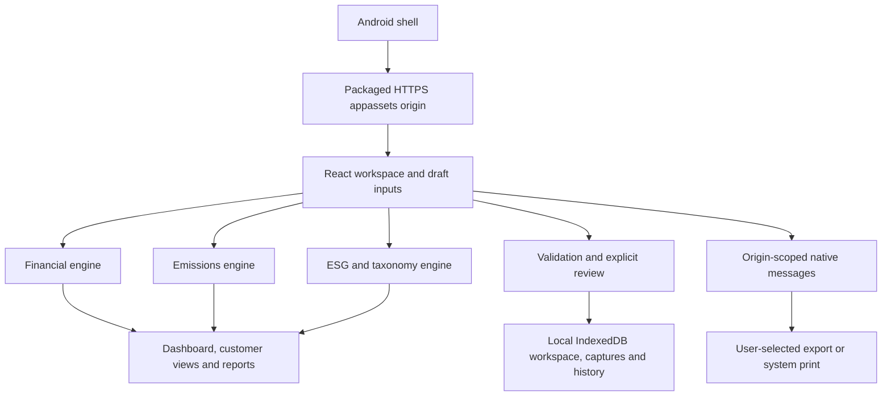

# ESG Banking — technical handover notes

Version 1.0.0 · Android offline edition · 27 September 2026

The source ZIP contains all buildable source plus the separate original cloud source and framework. Start with README.md after extracting it.

---

# Architecture and analytical model map

This edition packages the ESG Banking demonstration as an offline Android application. The React interface and three calculation engines run locally. The Android shell supplies the WebView, document picker, file export and print integration. There is no synchronization with the separately supplied cloud-reference application.

## Package map

| Directory | Responsibility |
|---|---|
| `android/` | Native shell, manifest, resources and Android build configuration. |
| `web/` | React application, styles, model inputs, calculation engines and local persistence adapter. |
| `scripts/` | Build and packaging helpers; consult the root README for verified commands. |
| `docs/` | Architecture, data contract, release procedures and limitations. |
| `cloud-reference/` | Original cloud implementation for reference; not a runtime dependency of the APK. |
| `framework/` | Research framework and offline HTML reading copy. |

The interface has nine workspaces: Overview, Customers, Scenario lab, Capital & earnings, Emissions, Evidence & actions, Taxonomy, Reports and Data workspace. They share one portfolio; each view is not a separate copy of the customer data.

## Runtime boundary

The native host is `android/app/src/main/java/com/esgbanking/workbench/MainActivity.java`. Its minimum is Android 9 / API 28, with Android System WebView 111 or later and the required bridge/browser features checked at startup. Assets are loaded under `https://appassets.androidplatform.net/assets/www/`. This is a local asset origin, not an Internet-hosted application. The manifest declares no Android `INTERNET` or broad storage permission. User-initiated external HTTPS research links leave the analytical WebView for the user's browser and may require connectivity there.

The native bridge is named `ESGNative`. Its listener permits only the exact appassets origin and the main frame, with bounded document-export and print operations. Unhandled/off-origin resource requests are blocked. File-URL access, mixed content, arbitrary browser permissions and automatic windows are disabled. Imported documents are bounded copies exposed through a nonexported FileProvider to the existing file-input workflow; they are never navigated to as privileged web content. The Android release record must distinguish source inspection/build checks from tests actually performed on a device; see [validation limits](VALIDATION_AND_LIMITATIONS.md).

`web/lib/offline-store.ts` owns IndexedDB persistence for the saved workspace, immutable scenario captures and local history. `web/lib/platform.ts` supplies native export/print requests and `components/platform-status.tsx` shows their outcomes. React holds the working draft. Save and explicit review advance the saved revision; editing an input or loading a captured run only changes the draft. A calculation does not itself save anything.

## Shared data and units

`web/lib/workspace.ts` defines the workspace envelope and validation. The default model version is `2026.09 · 1.0`. Defaults contain 24 borrowers, 36 facilities, 48 physical-risk sites and 30 emissions entities. All initial financial values, factors, evidence references and reviewer identities are synthetic.

Amounts are USD millions unless a field explicitly says otherwise. Facility `drawnLocalm` and `undrawnLocalm` are millions in the facility currency; `settings.fxUSDPerUnit` converts one local currency unit to USD. Emissions are tonnes CO2e; factors are kg CO2e per specified activity unit. Ratios and probabilities use decimal fractions. An empty numeric field is `null`, not zero.

Shared borrower/facility/site masters and the reporting date are authoritative across all engines. Changing FX or a facility balance changes financial exposure, financed-emissions attribution and taxonomy allocation limits together. Changing the selected credit stress scenario does not rewrite the historical emissions inventory. Egypt is the default bank profile; Jordan, UAE and Global are available. Country selection retains all portfolio markets and does not insert unverified regulatory minima or recalibrate tax rates.

## Financial transmission

Implementation: `web/lib/financial.mjs`; defaults: `financial_defaults.mjs`.

1. Scenario paths change demand, carbon/energy cost, interruption, repairs and transition investment. Physical-site shares connect borrower revenue and collateral to hazard, vulnerability, adaptation and insurance inputs.
2. Available cash and debt-service coverage feed an explicit PD sensitivity; physical loss changes LGD. These are illustrative transmission assumptions, not statistically estimated bank models.
3. Facility schedules model amortization, drawings, maturity, specified default timing, discounted recoveries, write-offs, allowances and undrawn provisions. Defaults are scheduled assumptions; a forecast PD does not automatically trigger a realized default.
4. Interest, credit charges, funding cost, expenses, market/operating losses and tax flow into retained earnings, cash and the balance sheet. Approved, evidenced management actions can add equity/funding and fees. The five-year schedule exposes reconciliations and before/after-action measures.
5. Credit RWA, fixed market/operational RWA inputs, capital deductions and capital instruments yield CET1, Tier 1, total-capital and headroom outputs. HQLA/outflow and ASF/RSF calculations are liquidity planning proxies.

Reporting ECL is a separate probability-weighted calculation using the configured accounting cases, staging, lifetime/12-month horizon and recovery timing. It is not the selected stress case relabelled as accounting ECL. The model demonstrates these connections; it is not a complete IFRS 9 implementation or a regulatory capital/liquidity filing engine. Existing loans run off; new originations are not assumed.

## Emissions accounting

Implementation: `web/lib/emissions.mjs`; inputs/reference: `emissions-reference.json`.

| Lending boundary | Attribution denominator in implemented route |
|---|---|
| Listed corporate | EVIC from the shared borrower record. |
| Private corporate | Nonnegative book equity plus debt from the shared borrower record. |
| Project finance | Nonnegative project equity plus project debt, specific to the project. |
| Commercial real estate, mortgage or motor | Original asset value, or a documented fixed fallback value. |

Actual drawn exposure is the numerator. Undrawn amounts, CCF and stressed credit EAD are not financed-emissions attribution amounts. Class, purpose, entity, evidence, period and denominator gates must pass. Corporate and designated-asset overlap is flagged for review rather than silently deduplicated.

Each scope selects reported emissions **or** complete eligible activity data. Factor matching checks the unit, activity, scope, country and period. Unsupported estimation routes stay pending. Scope 1, Scope 2 and investee Scope 3 have separate exposure coverage and data-quality outputs. Combined Scope 1+2 includes only facilities with both scopes ready. Known subtotals must remain beside coverage; `displayFinanced*` fields distinguish no coverage from measured zero.

Bank operations retain separate location-based and market-based Scope 2 totals. Contract criteria, retirement evidence and the residual-mix/grid-fallback rules govern the market-based route. These alternative totals must not be added; their difference is not a claim of physical abatement. `completeScope*` fields are unavailable when the relevant controlled inventory is incomplete. The 15-category bank Scope 3 register links Category 15 to the modeled lending inventory while retaining investee Scope 3 separately. Offsets, avoided emissions, facilitated emissions and insurance-associated emissions are not silently folded into this route.

## ESG decisions and taxonomy

Implementation: `web/lib/esg.mjs`; rules/reference: `esg-reference.json`.

Management scores are distinct from E&S decisions. A prohibition, critical unresolved E&S action or missing diligence/evidence can hold or decline a case despite a strong score. Scores do not mechanically change PD or RWA.

Taxonomy technical criteria, safeguards, allocation, review and claim approval are separate checks. Jordan 2026 and internal demonstration criteria are distinct schemes. A comparison selection cannot inherit an approval from another scheme. Readiness organizes jurisdiction-specific requirements and evidence; it does not certify compliance or turn internal target dates into regulatory deadlines.

Review fingerprints detect relevant record changes. They are not digital signatures, authenticated reviewer credentials, documentary verification or external assurance. The full source hierarchy and methodological context remain in the bundled framework.

---

# Data and local adapter contract

`web/lib/offline-store.ts` retains the cloud interface's data semantics while replacing network persistence with local IndexedDB. Paths such as `/api/workspace` name adapter operations; they are not remote API calls in the APK. The adapter rejects absolute off-origin operations, unknown paths and unsupported methods.

## Workspace envelope

| Field | Meaning |
|---|---|
| `modelVersion`, `name` | Compatibility marker and bank/workspace display name. |
| `scenario`, `country`, `taxonomySelection` | Selected stress, reporting profile and comparison context. |
| `actionsEnabled`, `carbonScale`, `physicalScale`, `actionOverride` | Explicit forecast controls; action year, amounts, approval and evidence. |
| `inputs` | Shared financial settings, borrowers, facilities, sites, bank assumptions, paths and action schedule. |
| `esg` | Actors, E&S assessments, taxonomy assessments, criterion tests, actions and readiness records. |
| `emissions` | Inventory entities, activity records, factors, operations and bank Scope 3 register. |

The saved revision and timestamp belong to the persistence envelope, not the workspace model. Derived engine results are recalculated; imported or submitted summaries are not authoritative inputs.

Database `esg-banking-offline-v1`, schema version 1, has three object stores:

| Store | Records |
|---|---|
| `meta` | `workspace`: `{id,formatVersion,revision,updatedAt,state}`; `sequence`: `{id,value}`. |
| `runs` | `{id,label,saved_at,state,summary,sequence}`. |
| `events` | `{id,created_at,action,details,revision,sequence}`. |

All stores use `id` as key. A monotonically increasing transaction sequence orders captures/history even if the device clock changes. A missing workspace in a nonempty database is treated as corruption, not as permission to reset. Reads check the saved model and compare each retrieved run's summary with a fresh calculation of its immutable inputs. Unsupported/corrupt storage returns a recovery error and remains intact.

Important join keys are borrower `id`, facility `borrowerId` and `emissionsEntityId`, inventory `id`/`borrowerId`, activity `entityId`/`siteId`/`factorId`, taxonomy `facilityId`/`borrowerId`, and criterion `assessmentId`. Evidence references are entered strings, not attached file contents. Review actors are local demonstration identities.

Reporting/financial dates use Excel serial days in shared financial inputs. Emissions and ESG records also accept their documented ISO date form. Do not convert missing fields to zero or invent dates to pass validation. JSON does not preserve `NaN`, infinity or JavaScript `undefined` as valid model values.

## Operations

| Operation | Input and result |
|---|---|
| `GET /api/workspace` | Initialize a deep-cloned default only if no saved workspace exists. Return `{state,revision,updatedAt,runs,events}`; initial revision is 0. |
| `PUT /api/workspace` | `{state,revision,description}` → `{state,revision,updatedAt}`. Validate, carry stored reviews, compare persisted revision, then atomically save state and one history event at revision+1. |
| `POST /api/runs` | `{state,label,revision}` → `{id,label,saved_at,summary}`. Capture an immutable draft snapshot and recalculated financial summary with an event. Does not save the draft or advance workspace revision. |
| `GET /api/runs?id=…` | Return `{id,label,saved_at,state,summary}`. Loading this result into the UI creates an unsaved draft. |
| `POST /api/review` | `{state,revision,kind,id}` → `{state,revision,updatedAt}`. Review one target, recalculate acceptance gates and atomically save the entire submitted workspace plus its event. |

Run labels are 1–100 characters after trimming. Save descriptions are limited to 500 characters. The workspace listing shows the newest 30 captures and 50 history events; these are presentation limits, not authorization to delete older data.

Adapter errors retain a numeric status: 400 for malformed requests, 404 for unknown records, 405 for unsupported methods, 409 for stale revisions, 413 for oversized requests, 422 for invalid data or a rejected review, and 503 for unavailable/corrupt storage. Request envelopes are limited to 1,800,000 UTF-8 bytes. Storage failure rejects the operation rather than reporting a false successful save. Local error status codes do not imply an HTTP server.

## Revision and review semantics

Revision comparison must happen against persisted data in the write transaction. Workspace changes and their events commit together; captures and their events commit together. A failed or stale operation must not leave a new stamp, event or partial state. Caller-owned drafts and stored snapshots must not share mutable object references.

Ordinary Save and Capture cannot manufacture review stamps. For each incoming criterion, taxonomy, action or readiness ID, copy the previously stored stamp and record type; remove submitted review fields where no stored stamp exists. A relevant edit then fails the old fingerprint. Only explicit Review may create a new stamp, and only for its requested target.

| Review kind | Required derived acceptance |
|---|---|
| `criterion` | `complete === true` |
| `action` | `decisionState === 'Closed'` |
| `taxonomy` | `claimState` is `Approved` or `Activity only` |
| `readiness` | `controlReadiness === 'Verified'` |

The ESG calculator checks the evidence, dates, owner/reviewer separation and decision gates. Review evaluates the assessment's stored scheme rather than granting approval from the top-level taxonomy comparison selection. Explicit Review saves the whole submitted draft, not only the visible record. Offline checks discourage accidental or imported approval changes; they do not establish a tamper-proof system against someone who controls the device or app data.

## Import and output conventions

CSV imports update existing borrower/facility IDs, with an explicit preview and Apply step. Unknown or duplicate IDs, unsupported columns, malformed quoting and blank numeric values are rejected. They do not create new lending records. Workspace JSON restore loads a compatible complete input state as a draft; the user must save it to replace the saved workspace.

Financial output includes `opening`, `reportingECL`, `bank`, `borrowerProjections` and `facilityProjections`. Emissions output includes portfolio/customer/sector/country aggregates, facility attribution, inventory, activity/factor results, operations, bank Scope 3 and `gaps`. ESG output includes borrower decisions, taxonomy, tests, actions, readiness and summary.

For emissions, use `displayFinancedS1S2` / `displayFinancedS3` with their independent coverage fields. Known `financed*` subtotals are not complete totals. Use `bank.completeScope1`, `completeScope2LB`, `completeScope2MB` and their complete combined alternatives for total headlines. A null output means unavailable or not applicable according to its status; display that status rather than a numeric zero.

Native document export and print use `web/lib/platform.ts` and the narrowly scoped `ESGNative.postMessage` bridge. Messages are JSON strings:

| Request | Shape |
|---|---|
| Export | `{id,action:'export',name,mime,text}` |
| Print | `{id,action:'print'}` |
| Reply | `{id,ok,cancelled?,error?}` |

The web caller uses a generated request ID, handles cancellation separately and times out after five minutes. `components/platform-status.tsx` displays the result. Native export permits JSON, CSV or plain text, sanitizes the filename and limits UTF-8 content to 5 MiB. Native document operations are serialized and reject duplicate request IDs. Export success follows completion of the native file write.

The native print flow observes Android `PrintJob` completion, cancellation or failure before replying. If the job remains pending after 290 seconds, it reports that state, releases other document operations and directs the user to the Android print queue; it does not claim success or cancel the job. A second print is blocked while the prior job remains pending. Opening the print dialog alone is not success, and an acknowledgement does not independently inspect the output's content or pagination. The web print helper waits two animation frames before requesting native printing; this is not a device-verified layout guarantee.

HTML file inputs use a single-document SAF picker. Native import accepts a bounded candidate CSV/JSON/text document up to 5 MiB, copies it into private cache and returns the copy through a nonexported FileProvider. Cancellation returns no selection. The web layer still applies its stricter 1,500,000-byte CSV and 1,800,000-byte workspace file limits and semantic validation. Ordinary browser preview has a Blob-download/window-print fallback.

---

# Installation, backup and release operations

The application ID is `com.esgbanking.workbench`, version name `1.0.0`, version code `1`. Use the root README for the delivered APK name, checksum and exact build commands. This document describes operation and release safeguards without asserting device tests that have not been performed.

## Install and start

The target is Android 9 / API 28 or newer with Android System WebView 111 or newer. Update the active WebView provider if the app reports an unsupported runtime. Android OS support alone does not guarantee the required browser capabilities.

Transfer the APK to the device and open it through the device's installer. If required, grant the selected installer permission to install from that source. Verify the delivered checksum before installation when the APK has passed through another transfer channel. The application can then start with its packaged demonstration data without signing in or connecting to a server.

The release is configured as nondebuggable and signed with a demonstration-only key. That private key is intentionally excluded from the source ZIP. Source recipients must use their own signing key; it cannot update the demonstration installation under the same application ID unless Android accepts the same signing identity. Use a distinct application ID for a parallel installation, or export important work before uninstalling the demonstration to install a differently signed build. Neither the signing choice nor APK delivery is a Play Store submission claim.

An update preserves app data only when Android accepts it as an update of the same application and compatible signing identity. Do not uninstall merely to resolve a signing mismatch: uninstalling can remove the local workspace and captures. Export important work first.

## Save, capture and export

Input edits are a working draft until Save succeeds. Android may terminate an application without a browser unload event. Save material changes before leaving the application; a warning on navigation is not a persistence guarantee.

Capturing a scenario stores the exact current inputs and a calculated financial summary for comparison. It does not save the workspace draft. Opening a capture restores its inputs as a draft; Save makes that draft the new workspace. Explicit evidence Review also saves the entire submitted workspace when its checks pass.

The standard **Download complete workspace** JSON contains model inputs for one workspace. It is not a backup of the IndexedDB database, captured-run collection or history. To retain a particular captured scenario independently, load it as a draft and export that workspace JSON with a distinctive name. Derived-results JSON, CSV exports and a report PDF support review but are not substitutes for the editable workspace JSON.

Use the system document picker to select an export destination. The native export operation must report completion after the file is written; cancelling leaves the workspace unchanged. Keep a copy outside app-private storage and verify it can be reopened. A user-selected cloud-backed document provider may synchronize the exported file under that provider's policy; the ESG application itself performs no synchronization.

To restore, choose a workspace JSON through Data → Import data. A compatible file is validated and loaded as an unsaved draft. Inspect its name, reporting date, controls and key outputs, then save deliberately. Model-version incompatibility requires a defined migration; it must not silently reset data. Imported review fields do not bypass the current stored-review rules.

## Data retention

Workspace data is stored locally for this application installation. The manifest disables automatic backup, and extraction rules exclude app data from cloud backup and device transfer. Clearing app storage, uninstalling, device loss or storage failure can remove it. No account recovery, cloud backup or remote administrator is provided by this edition. Local history is useful operational context, not an authenticated or tamper-proof audit log.

Review identities and initial evidence references are demonstration records. Avoid describing the app's local reviewer selection as user authentication or independent assurance. Device locks, export access and any subsequent organizational controls are outside the analytical model.

## Build and release checklist

The selected toolchain is AGP **8.9.2**, Gradle **8.11.1**, JDK **17**, compile/target SDK **35**, and Build Tools **35.0.0**. Native dependencies include AndroidX WebKit **1.12.1**, Activity **1.10.1** and Core **1.15.0**. The checked-in build files and root build record are authoritative. Web dependencies are lockfile-pinned; use the documented clean install/build procedure instead of silently upgrading model or UI dependencies.

For each release:

1. Build the web assets and copy them into the native `assets/www/` package through the documented build helper. Confirm no runtime assets depend on a CDN or cloud API.
2. Run the model, adapter and build checks recorded in the root verification report. Verify application/version identifiers, packaged files and manifest permissions.
3. Produce the APK with the documented signing mode and record its SHA-256. Preserve the signing identity securely for future updates; do not include a production private key in a public source bundle.
4. Perform the device acceptance checks in [validation limits](VALIDATION_AND_LIMITATIONS.md), including export/restore and process restart. Record device model, Android version, WebView provider/version, APK hash and results.
5. Package `android/`, `web/`, `docs/`, `scripts/`, the original `cloud-reference/` and `framework/`. Include relevant licenses and reproducible build configuration; exclude caches, installed dependencies, local credentials and unrelated workspace data.

Opening the Android print dialog is not a successful PDF test. Check the resulting document's charts, tables, units and footnotes. Pagination and available print destinations depend on the device's print implementation.

---

# Validation evidence and limits

Source review, automated calculation tests, browser tests, APK assembly and physical-device tests establish different things. The root release verification record identifies which were actually completed for the delivered APK. This document does **not** claim physical-device, emulator, process-death, native SAF or Android print testing.

## What the checks establish

| Check | Evidence it can provide | What it does not establish |
|---|---|---|
| Model parity and mutation tests | Reviewed synthetic outputs, recalculation and selected rejection/coverage rules. | Real-world calibration, regulatory acceptance or exhaustive method support. |
| Workspace/import tests | Schema guards, missing-versus-zero behavior, CSV parsing and shared-input propagation. | Correctness of customer-supplied evidence. |
| Local adapter tests | Save conflicts, atomic transactions, review-stamp handling and immutable captures in the tested IndexedDB environment. | Android lifecycle reliability on an untested device. |
| Type check and production build | Source compatibility and asset generation under the selected toolchain. | Successful installation or complete WebView rendering. |
| APK inspection/signature verification | Package identity, manifest/assets and signature/checksum properties. | Production signing-key custody or operational security certification. |
| Native device acceptance | Behavior on the recorded OS/WebView/device and tested flows. | Universal compatibility with all devices/providers. |

The reference-engine work recorded 11,952 financial comparisons, 5,404 emissions assertions across 34 mutation cases, and 63 ESG parity/mutation checks. These are prior model evidence, not additional Android device tests. The packaged `web/tests/verify-models.mjs` exercises integration and selected mutations.

The local adapter's `web/tests/verify-offline.mjs` passed 38 checks using `fake-indexeddb`, including concurrent/stale writes, immutable captures, explicit review gates, storage-write rollback injection, retention beyond the listing limits and module reload. This is an in-process IndexedDB test environment: injected quota failures and module reload are not an actual Android full-disk or process-kill test. Use the root release logs for final source/build check outcomes.

## Required native acceptance

- Install, start in airplane mode, navigate all nine views and verify dialogs/charts at phone and tablet sizes.
- Save an input change; restart, rotate and force-stop/reopen. Confirm saved state and revision survive without treating unsaved edits as saved.
- Trigger two writes from the same revision: one must win, the other must conflict without a partial history entry. Confirm failed storage or a rejected review leaves the old saved data intact.
- Capture an unsaved scenario and retrieve it after further edits/restart. Confirm capture does not advance the workspace revision or change the captured input/summary.
- Attempt ordinary Save/Capture with forged imported review fields; confirm that only trusted stored stamps are carried and changed evidence still requires review.
- Export JSON and CSV, cancel each picker, restore the exported JSON and compare inputs. Check 30 or more captures without silent deletion and test storage failure handling.
- Complete native print/Save as PDF and inspect charts, long tables, dates and boundary notes. Test Back from a dialog, from another view and from the app root.
- Test a compatible signed upgrade with saved data. Confirm older/incompatible model data is reported for migration rather than replaced by defaults.
- Verify that unknown schemes, off-origin web navigation and non-main-frame bridge calls cannot invoke privileged operations. External references must not load inside the privileged analytical WebView.

## Analytical boundaries

The default portfolio, factor registry, scenario calibrations and reviewer records are synthetic. An apparent positive headroom, green classification or complete inventory is conditional on those inputs and the implemented scope. It is not a bank's regulatory result.

The financial model uses explicit cash-flow transmission, simplified credit-risk sensitivities and a five-year run-off book. Reporting ECL, stressed provisions, realized default timing and prudential RWA are separate modeled concepts. Liquidity ratios are planning proxies, not full regulatory LCR/NSFR templates. Additional products, netting, collateral rules, legal entities and regulatory adjustments require specified methods and validation.

The emissions engine implements selected lending routes and operational GHG accounting gates. It does not implement all PCAF asset classes/options or every GHG estimation route. Missing/unsupported data reduces coverage; it must not become zero emissions. Externally sourced factors need documented geography, unit, boundary, version, validity and quality. Operational Scope 2 accounting alternatives are separate totals, and financed emissions are not priced-emissions inputs for financial stress.

Taxonomy eligibility, safeguards and approved financing allocation are separate. Internal demonstration criteria are not certification; applying a Jordan reference outside Jordan does not create local legal applicability. Readiness organizes requirements and evidence for review rather than attesting compliance. The bundled framework explains source authority, dependencies and version qualifications.

## Operational boundaries

This edition has one local workspace per app installation, no cloud synchronization, no authenticated maker/checker role system and no protected enterprise evidence repository. A review fingerprint is a change detector, not cryptographic assurance of identity or truth. Device time supplies history timestamps; the selected reporting date governs analytical validity.

Application validation reduces accidental malformed input; local software and data remain under the device holder's control. The app does not promise resistance to rooted-device modification, forensic extraction, arbitrary app-data manipulation or recovery after uninstall. No independent penetration test, accessibility certification or regulatory compliance assessment is claimed.

---

# Cloud-reference application

`cloud-reference/` preserves the original cloud application source for comparison and future maintenance. It is not loaded by the Android APK and is not a synchronization service. The Android local workspace and the cloud workspace are separate data stores.

## Original architecture

The reference uses React with the Next-compatible Vinext/Vite build, Cloudflare Workers runtime and a D1 binding named `DB`. Its application routes are `app/api/workspace/route.ts`, `app/api/runs/route.ts` and `app/api/review/route.ts`. `lib/server-store.ts` supplies authentication access, bounded JSON parsing, validation, stored-review handling and safe response helpers. `lib/workspace.ts` and the three `.mjs` model modules define the shared analytical behavior.

The cloud authentication boundary obtains the platform-authenticated user identity; every workspace/run/history query is scoped to that owner. This boundary depends on the intended hosting platform. Local development's synthetic sign-in is not a production identity mechanism. The Android edition does not reproduce or claim cloud authentication.

The D1 schema has `workspaces`, `runs` and `events`. Workspace revision checks reject conflicting saves. Scenario captures store complete inputs and a calculated summary. Explicit review recalculates evidence gates before recording a reviewed workspace revision. Review actor names remain demonstration identities even though the workspace owner is authenticated.

## Maintain or redeploy the reference

Use the supplied reference README, package lockfile and hosting configuration for its original build flow. The source contains schema-only migrations under `drizzle/`; build output includes the hosting migration package. Node 22.13 or newer is the declared reference runtime requirement. Tests distinguish pure model checks from API checks requiring the running local development server.

Deployment identifiers in `.openai/hosting.json` describe the original project; they are not credentials, a portable database backup or permission to overwrite an existing deployment. A separate deployment needs its own configured project/database and the platform's authenticated deployment workflow. Do not point a demonstration or test run at another user's production store. Authentication-header trust and binding configuration must be preserved by the intended hosting environment.

The local API tests use synthetic development identity and may reset their test workspace. Run them only against the documented development instance. Export data and back up any real deployment before schema or model changes. No cloud database content is bundled with the source ZIP.

## Sharing improvements between editions

Keep financial, emissions and ESG rules aligned through parity tests. A shared rule change should update defaults/reference data, model version, validation and tests deliberately. Offline-specific changes belong in the local adapter and native bridge; cloud owner scoping and server persistence must not be replaced by Android assumptions.

The editable workspace JSON is the common analytical transfer format. Import loads a draft and applies current validation/review rules; it is not automatic synchronization, authenticated evidence transfer or a migration of captures/history. Cross-version imports require an explicit migration rather than silent field substitution.

---

# Release verification — ESG Banking Android 1.0.0

Executed on 27 September 2026 in the Windows build workspace.

| Check | Result |
|---|---|
| Financial, ESG, emissions and CSV regression checks | 38 passed |
| IndexedDB adapter checks | 38 passed, using fake-indexeddb |
| Web/native bridge contract checks | 22 passed, using fake window/timers |
| TypeScript | Passed |
| Production web bundle | Passed; all executable assets bundled |
| Android assembleRelease | Passed |
| Android lintRelease | Passed, 0 errors; 5 warnings (3 pinned dependency versions, 2 untranslated native button labels) |
| APK alignment/signature | Verified with Android zipalign/apksigner; RSA 3072-bit demonstration certificate, APK Signature Scheme v3 |
| Manifest | com.esgbanking.workbench; version 1.0.0 / 1; min API 28; target API 35; non-debuggable; no Internet or broad storage permission |
| Packaged web assets | Byte-for-byte equality with final compiled web assets |
| Browser workflow | Selected Physical shock, saved, reloaded and confirmed persistence; captured immutable run visible; mobile navigation to report works |
| Phone layout | 390 × 844 viewport tested; content/viewport width matched at 375 CSS px excluding scrollbar; screenshot visually reviewed; no console errors observed |

**Not performed:** physical Android installation, emulator execution, real Android file-picker/export round-trip, actual Android PDF output, process-kill/upgrade persistence, OS storage exhaustion. The browser and contract tests do not substitute for those device checks. The APK is suitable for a controlled demonstration and device acceptance testing; no production banking or regulatory certification is asserted.

The Android SDK metadata emitted a nonblocking schema-version warning because the installed SDK manager is newer than AGP. The compile platform is API 35, revision 2, and the build completed successfully. Java reports deprecated compatibility calls used for older supported Android versions.

APK bytes: 5887725

APK SHA-256: `6d42d1cc7db0da29322f090277477ea74c3d84e5b021b204f2682a5e324180e8`

Certificate SHA-256: `0cf28ef0a1efc2ca9b45cead9f03cf5f95f31da2494703d5e9f750c0c63bd6c9`

The source ZIP excludes private signing keys, account configuration, dependency/build caches and local user data. See APK_SIGNATURE.txt for the verifier output and the delivery SHA256SUMS.txt for all artifact checksums.
